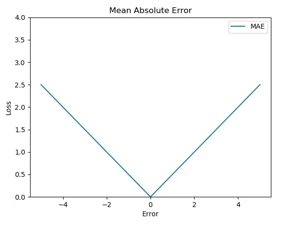
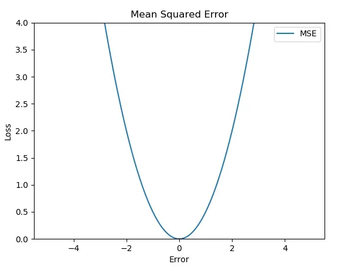
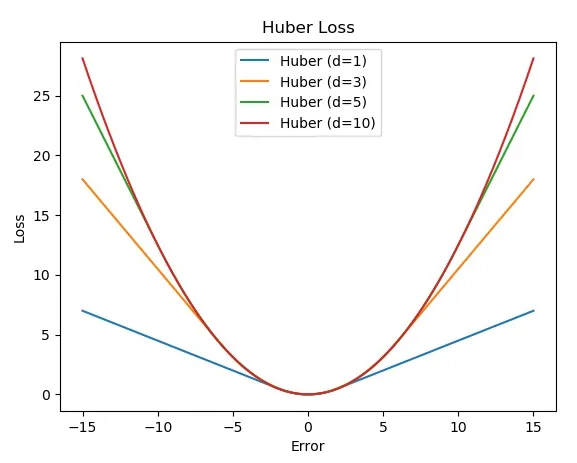
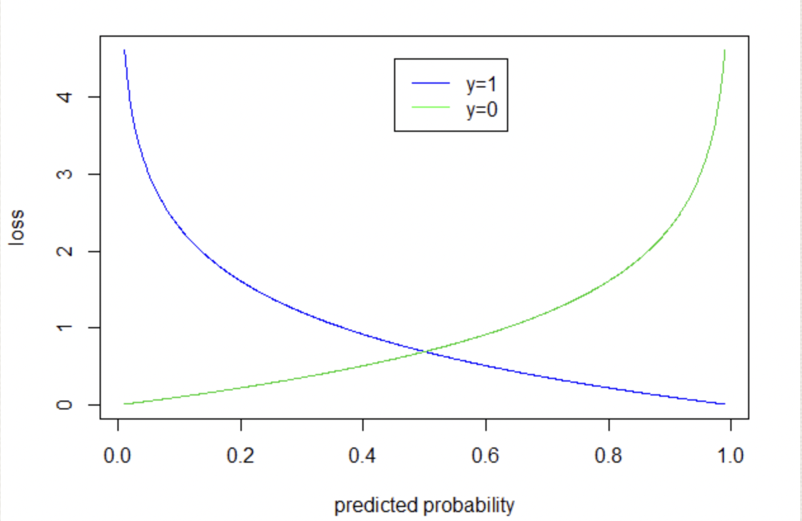

# Understanding Loss functions in PyTroch

## Table of Contents

- [Loss functions in PyTorch](#loss-functions-in-pytorch)
  - [nn.L1Loss](#nnl1loss)
  - [nn.MSELoss](#nnmseloss)
  - [nn.Huberloss](#nnhuberloss)
  - [nn.BCELoss](#nnbceloss)
  - [nn.CrossEntropyLoss](#nncrossentropyloss)
  - [CTCLoss](#ctcloss)

## Loss functions in PyTorch

Loss funciton are the method of evaluating how well the model that we have built works. It measures how far the prediction and actual target is . It is also called error or cost function. Our task in training AI models is to minimize this loss function. 

### nn.L1Loss

Measures the mean absolute error(MAE) . Given a target $`Y`$ and out predicted output $`(\hat Y)`$, it calculates the mean absolute error between each data in these vector.

Mean Absolute Error (MAE) = $` Y -  \hat Y  `$.




```python
torch.nn.L1Loss(  reduction = 'none   )
```

Parameters :
* reduction(str) : Specifies the reduction to apply to the output: 
    'none' : no reduction will be applied  
    'mean' : the sum of the output will be divided by the   number of elements in the output  
    'sum' : the output will be summed  

with `reduction` set to `none` nn.L1Loss is 

```math
l(x,y) = L = {l_1,l_2,.......,l_N}^T , l_n = | x_n - y_n |
\\
\text{where N is the total batch size.}
\\ then \\
\begin{cases}
mean(L) & \text{if reduction = 'mean'} \\
sum(L) & \text{if reduction = 'sum'}
\end{cases}
```

`x` and `y` are tensors of arbitrary shapes with a total of n elements each.


```python
x = torch.randn(size = (5,3))
y = torch.randn(size = (5,3))
```


```python
Error = x - y
print(Error)
```

    tensor([[ 1.1955, -0.2542,  0.2666],
            [-3.3301,  1.4459, -0.7097],
            [-0.9593,  1.4890, -1.1341],
            [ 3.4275, -1.4349,  1.0722],
            [ 0.6549, -0.6395, -0.6933]])


When we take L1 loss the errors absolute is only returned.


```python
L1_loss = nn.L1Loss( reduction = 'none' )
loss = L1_loss(x,y)
print(loss)
```

    tensor([[1.1955, 0.2542, 0.2666],
            [3.3301, 1.4459, 0.7097],
            [0.9593, 1.4890, 1.1341],
            [3.4275, 1.4349, 1.0722],
            [0.6549, 0.6395, 0.6933]])


Lets see the output when `reduction` is set to `mean`


```python
print(nn.L1Loss(reduction= 'mean') (x,y) )
```

    tensor(1.2471)


### nn.MSELoss

Measures the mean squared error (MSE). Given a target $`Y`$ and our predicted output $`(\hat{Y})`$, it calculates the mean squared error between each element in these vectors.

Mean Squared Error (MSE) = $`(Y - \hat{Y})^2`$.




```python
torch.nn.MSELoss(reduction='none')
```

Parameters:
* `reduction` (str): Specifies the reduction to apply to the output:
  * `'none'`: No reduction will be applied.
  * `'mean'`: The sum of the output will be divided by the number of elements in the output.
  * `'sum'`: The output will be summed.

With `reduction` set to `none`, `nn.MSELoss` is:

```math
l(x, y) = L = \{l_1, l_2, \ldots, l_N\}^T, \quad l_n = (x_n - y_n)^2
\text{where N is the total batch size.}
\\
\text{then} \\
\begin{cases}
\text{mean}(L) & \text{if reduction = 'mean'} \\
\text{sum}(L) & \text{if reduction = 'sum'}
\end{cases}
```

`x` and `y` are tensors of arbitrary shapes with a total of `N` elements each.


```python
MSE_loss = nn.MSELoss(reduction='none')
loss = MSE_loss(x, y)
print("MSE Loss with no reduction:\n", loss)
```

    MSE Loss with no reduction:
     tensor([[ 1.4291,  0.0646,  0.0711],
            [11.0898,  2.0907,  0.5037],
            [ 0.9202,  2.2171,  1.2862],
            [11.7475,  2.0588,  1.1497],
            [ 0.4289,  0.4090,  0.4806]])


```python
mean_loss = nn.MSELoss(reduction='mean')(x, y)
print("MSE Loss with mean reduction:\n", mean_loss)
```

    MSE Loss with mean reduction:
     tensor(2.3965)


```python
sum_loss = nn.MSELoss(reduction='sum')(x, y)
print("MSE Loss with sum reduction:\n", sum_loss)
```

    MSE Loss with sum reduction:
     tensor(35.9472)


### nn.HuberLoss
It acts as the combination of both `MAE` and `MSE` loss. It has extra parameter delta . If the absolute element erros falls below delta it will use `MSE` else it will use `L1` loss.
It has the advantage of both `MAE` and  `MSE`.
For a batch of size N, the unreduced loss can be described as 
$` l(x,y) = L = \{ l_1 , ...., l_N \}^T `$

with 

```math
l_n = 
\begin{cases}
0.5 (x_n -y_n)^2 & \text{if } |x_n - y_n | < delta \\
delta*(|x_n - y_n| - 0.5 * delta) & \text{otherwise}
\end{cases}
```

if reduction is not none :

```math
l(x,y) = 
\begin{cases}
\text{mean}(L) & \text{if reduction = 'mean'} \\
\text{sum}(L) & \text{if reduction = 'sum'}
\end{cases}
```




### nn.BCELoss


Measures the Binary Cross Entropy (BCE) between the target and the predicted output. This loss is used for binary classification problems.

Binary Cross Entropy Loss (BCE) is defined as:

```math
\text{BCE}(x, y) = -w_n \left( y \cdot \log(x) + (1 - y) \cdot \log(1 - x) \right)
```
where $`x`$ is the predicted output and $`y`$ is the target.  
$`w_n`$ refers to the weights of the class which does manual rescaling in case the two classes are unbalanced.



```python
torch.nn.BCELoss(weight=None, size_average=None, reduce=None, reduction='mean')
```

Parameters:
* `weight` (Tensor, optional): A manual rescaling weight given to each batch element. If given, it has to be a Tensor of size `nbatch`.
* `reduction` (str): Specifies the reduction to apply to the output: `'none'` | `'mean'` | `'sum'`. `'none'`: no reduction will be applied, `'mean'`: the sum of the output will be divided by the number of elements in the output, `'sum'`: the output will be summed.

With `reduction` set to `none`, `nn.BCELoss` is:

 ```math
l(x, y) = L = \{l_1, l_2, \ldots, l_N\}^T, \quad l_n = -w_n \left( y_n \cdot \log(x_n) + (1 - y_n) \cdot \log(1 - x_n) \right)
\text{where N is the batch size.}
\\
\text{then} \\
\begin{cases}
\text{mean}(L) & \text{if reduction = 'mean'} \\
\text{sum}(L) & \text{if reduction = 'sum'}
\end{cases}
 ```

`x` and `y` are tensors of the same shape.

**Lets create a random predicted outputs and target values**


```python
torch.random.manual_seed(seed = 100)
x = torch.sigmoid(torch.randn(size=(5, 1)))  # Predicted outputs in range [0, 1]
y = torch.randint(0, 2, size=(5, 1)).float()  # Binary target values
x,y
```


    (tensor([[0.5892],
             [0.4290],
             [0.4028],
             [0.5604],
             [0.2005]]),
     tensor([[0.],
             [0.],
             [0.],
             [0.],
             [1.]]))


**In above case, we have a batch where there are 5 prediction made.**

**Initializing BCELoss with no reduction**


```python
bce_loss = nn.BCELoss(reduction='none')
print(bce_loss(x,y))
```

    tensor([[0.8896],
            [0.5604],
            [0.5155],
            [0.8220],
            [1.6071]])


**Lets confirm it through our own formula**
for a sample :   
prdicted = 0.2005 , target = 1
 ```math
\text{BCE}(x, y) = -\left( y \cdot \log(x) + (1 - y) \cdot \log(1 - x) \right)
 ```


```python
calc_loss = - (1 * np.log(0.2005)  + (1 - 1) * np.log(1 - 0.2005) )
calc_loss
```


    1.606941032235513


Thus, it matches. Now similarly


```python
# Calculating the BCE loss with mean reduction
mean_loss = nn.BCELoss(reduction='mean')(x, y)
print("BCE Loss with mean reduction:\n", mean_loss)

# Calculating the BCE loss with sum reduction
sum_loss = nn.BCELoss(reduction='sum')(x, y)
print("BCE Loss with sum reduction:\n", sum_loss) 
```

    BCE Loss with mean reduction:
     tensor(0.8789)
    BCE Loss with sum reduction:
     tensor(4.3946)


### nn.CrossEntropyLoss

In the previous `BinaryCrossEntropy` loss, we calculated loss in case where there is only two classes. So for a more general case we use `CrossEntropyLoss`.
Measures the Cross Entropy Loss between the input logits and target values. It is mostly used in classification problem. This loss combines `nn.LogSoftmax()` and `nn.NLLLoss()` in one single class.

Given a target $`Y`$ (which is a class index) and our predicted output $`X`$ (which are raw, unnormalized logits of each class),X will have value for each class. It should be a tensor of size `C` for unbatched input. For batched 1 dimensional input the predicted output X is `(minibatch,C)` and if higherdimensional it is `(minibatch,C,d1,d2,....,dk)` like for 2 dimensional image.


With `reduction` set to `none`, `nn.CrossEntropyLoss` is:

 ```math
l(x, y) = L = \{l_1, l_2, \ldots, l_N\}^T, \quad l_n = - w_{y_n} \log\left(\frac{\exp(x_{n,y_n})}{\sum_{j=1}^{C} \exp(x_{n,j})}\right)
\text{where N is the batch size.}
\\
\text{then} \\
\begin{cases}
\text{mean}(L) & \text{if reduction = 'mean'} \\
\text{sum}(L) & \text{if reduction = 'sum'}
\end{cases}
 ```

In the above case, we have N batch prediction made and each prediction inside the batch has logit value for each class. $`w_{y_n}`$ refers to the weight assined to the class


 it calculates the loss as follows:
 ```math
\text{Cross Entropy Loss} = -\sum_{i=1}^{C} y_i \log\left(\frac{\exp(x_i)}{\sum_{j=1}^{C} \exp(x_j)}\right)
 ```
where `C` is the number of classes, $`y_i`$ is the ground truth label (one-hot encoded), and $`\hat{y}_i`$ is the predicted score for class `i`.


```python
torch.nn.CrossEntropyLoss(weight=None, ignore_index=-100,  reduction='mean')
```

Parameters:
* `weight` (Tensor, optional): A manual rescaling weight given to each class. If given, has to be a Tensor of size `C`.
* `ignore_index` (int, optional): Specifies a target value that is ignored and does not contribute to the input gradient. When `size_average` is `True`, the loss is averaged over non-ignored targets.
* `reduction` (str): Specifies the reduction to apply to the output: `'none'` | `'mean'` | `'sum'`. `'none'`: no reduction will be applied, `'mean'`: the sum of the output will be divided by the number of elements in the output, `'sum'`: the output will be summed.


`x` is a tensor of shape `(N, C)` where `N` is the batch size and `C` is the number of classes. `y` is a tensor of shape `(N)` with class indices.

**Lets take a example**

We have prediction of Batch size of 5 and 3 classes


```python
torch.random.manual_seed(seed = 100)
x = torch.randn(size=(5, 3))  
y = torch.tensor([0, 2, 1, 2, 0])   
x,y
```


    (tensor([[ 0.3607, -0.2859, -0.3938],
             [ 0.2429, -1.3833, -2.3134],
             [-0.3172, -0.8660,  1.7482],
             [-0.2759, -0.9755,  0.4790],
             [-2.3652, -0.8047,  0.6587]]),
     tensor([0, 2, 1, 2, 0]))


```python
cross_entropy_loss = nn.CrossEntropyLoss(reduction='none')
loss = cross_entropy_loss(x, y)
print("Cross Entropy Loss with no reduction:\n", loss)
```

    Cross Entropy Loss with no reduction:
     tensor([0.6902, 2.7987, 2.7966, 0.5327, 3.2708])


Lets confirm it through formula :
For the `sample : [ 0.3607, -0.2859, -0.3938]` and the `actual class is 0`
 ```math
\text{Cross Entropy Loss} = -\sum_{i=1}^{C} y_i \log\left(\frac{\exp(x_i)}{\sum_{j=1}^{C} \exp(x_j)}\right) 
 ```

In this formula the inner part inside the bracket applies the softmax function.


```python
x_np = x.numpy()
y_np = y.numpy()
exp_x = np.exp(x_np[0]) # Calulate the exponential of the first sample data
calc_loss = - np.log(exp_x[0] / np.sum(exp_x)) # Take data of index 0 as the the actual class for this sample is 0.
calc_loss
```


    0.69018966


The $`y_i`$ value becomes 1 for index i = 0 and for all other case it is zero. So we calculated loss using only index 0

**Similarly**


```python
mean_loss = nn.CrossEntropyLoss(reduction='mean')(x, y)
print("Cross Entropy Loss with mean reduction:\n", mean_loss)
```

    Cross Entropy Loss with mean reduction:
     tensor(2.0178)


```python
sum_loss = nn.CrossEntropyLoss(reduction='sum')(x, y)
print("Cross Entropy Loss with sum reduction:\n", sum_loss)
```

    Cross Entropy Loss with sum reduction:
     tensor(10.0890)


### CTCLoss

This is used in cases where have to map a sequence X to sequence Y. For example these are manily used in speech recognition.

It stands for Connectionist Temporal Classification Loss.  It calculates loss between a conitnuos time series and target sequence.


```python
ctc_loss = nn.CTCLoss()
loss = ctc_loss(input,target, input_lengths, target_lengths)
```
**Parameters**

* reduction : Specifies the reduction to apply to the output `none` | `mean` | `sum`
* zero_infinity (bool) : whether to zero if any infinite losses and the associated gradients occurs.

CTC is basically an algorithm employed to train deep neural networks in task such as speech recognition and handwriting recognition or other sequential problems where there is no information about alignment between input and output.

**`CTC Model`** 

In speech recognition, we have an audio clip and its transcribed word as output. But audio clip and transcibed word can be different for different people. Same word can be said in different way meaning person can emphasize different part of word when speaking. So , for large dataset, hand labeling individual data would be impractical.
For this type of tasks we use CTC Loss.

Applications of CTC

The CTC algorithm finds application in domains which do not require explicit alignment information between inputs and outputs during training like

    Speech Recognition
    Music Transcription
    Gesture Recognition
    In processing sensor data for robotics system


```python
ctc_loss = nn.CTCLoss()
loss = ctc_loss(log_probs, targets, input_lengths, target_lengths)
```

The arguments that needs to be passed are

    log_probs: The input sequence of log probabilities. It is typically the output of a neural network applied to the input sequence.
    targets: The target sequence. This is usually a 1-dimensional tensor of class indices.
    input_lengths: A 1-dimensional tensor containing the lengths of each sequence in the batch.
    target_lengths: A 1-dimensional tensor containing the lengths of each target sequence in the batch.

 