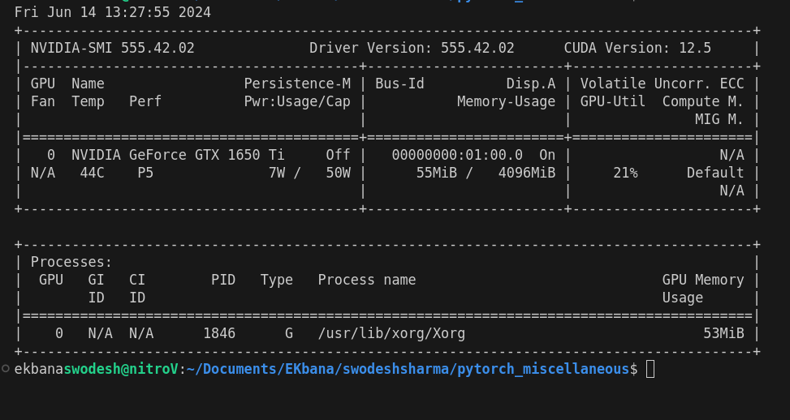

# Pytorch Miscellaneous

## Table of Contents

- [Running Tensors on GPUS](#running-tensors-on-gpus)
  - [Checking pytorch for cuda support](#checking-pytorch-for-cuda-support)
  - [Counting number of GPU](#counting-number-of-gpu)
  - [Putting Tensors (and models) on the GPU](#putting-tensors-and-models-on-the-gpu)
  - [Setting the default device globally](#setting-the-default-device-globally)
  - [Parallel Processing with Python](#parallel-processing-with-python)
  - [Neural Network Training with GPU Acceleration](#neural-network-training-with-gpu-acceleration)
  - [Clearing GPU memory](#clearing-gpu-memory)
- [Model Ensembling](#model-ensembling)
  - [`torch.func.functional_call`](#torchfuncfunctionalcall)


## Running Tensors on GPUS

To use pytorch with GPU we need cuda support.

we can check the cuda support through

```bash
nvidia-smi
```



### Checking pytorch for cuda support


```python
import torch
torch.cuda.is_available()
```


    True


We can automatically setup our code to run on either gpu if available as :

```python
# Set device type
device = "cuda" if torch.cuda.is_available() else "cpu"
device
```

### Counting number of GPU


```python
torch.cuda.device_count()
```


    1


### Putting Tensors (and models) on the GPU

**Create tensor (default on CPU)**


```python
tensor = torch.tensor([1, 2, 3])
print(tensor, tensor.device)
```

    tensor([1, 2, 3], device='cuda:0') cuda:0


**Moving the tensors to GPU**


```python
device = 'cuda'
tensor_on_gpu = tensor.to(device)
tensor_on_gpu
```


    tensor([1, 2, 3], device='cuda:0')


Now it will be important to convert the tensors between the devices. Tensors on one device wont perform operation with tensors on another device. Lets look at some condition where having tensors on GPU can cause errors.

```python
tensor_on_gpu.numpy()
```

This code throws error, because Numpy isn't setup for utilizing GPU.


So, we convert the tensor back to CPU then utilize the `.numpy()` functionality.


```python
import numpy as np
tensor_on_cpu = tensor_on_gpu.cpu()
tensor_on_cpu.numpy()
```


    array([1, 2, 3])


### Setting the default device globally


```python
torch.set_default_device('cuda')
```

### Parallel Processing with Python

To perform parallel processing we distribute computation tasks across multiple GPUs or computations within a single GPU.

`torch.nn.DataParallel` module simplifies parallel processing across multiple GPUS

**lets see the time difference between CPU and GPU**


```python
import torch
import time
```


```python
#Initialisation of tensors
dim=2000

start_time = time.time()
x = torch.randn(dim,dim).to('cpu') 
elapsed_time = time.time() - start_time
print('CPU_time = ',elapsed_time)

start_time = time.time()
x=torch.randn((dim,dim), device=torch.device("cuda:0"))
elapsed_time = time.time() - start_time
print('GPU_time = ',elapsed_time)
```

    CPU_time =  0.011161327362060547
    GPU_time =  0.0002484321594238281


### Neural Network Training with GPU Acceleration


```python
import torch
import torch.nn as nn

# Example model
class Generate(nn.Module):
    def __init__(self):
        super(Generate, self).__init__()
        self.gen = nn.Sequential(
            nn.Linear(5,1),
            nn.Sigmoid()
        )

    def forward(self, x):
        return self.gen(x)

model = Generate() # Initialize the model
model.to('cuda') # Move the model to the GPU

# Create input data inside GPU
input_data = torch.randn(16, 5, device=device)
output = model(input_data) # Forward pass on theGP
output

```


    tensor([[0.5157],
            [0.5141],
            [0.3848],
            [0.5058],
            [0.4372],
            [0.3297],
            [0.3459],
            [0.2833],
            [0.3914],
            [0.3355],
            [0.4457],
            [0.3978],
            [0.4221],
            [0.4410],
            [0.3317],
            [0.3787]], device='cuda:0', grad_fn=<SigmoidBackward0>)


### Clearing GPU memory

PyTorch supplies the `torch.cuda.empty_cache()` function, which aids in releasing GPU memory that is no longer in use. 

## Model Ensembling

Model ensembling refers to  combining decisions from multiple models to improve the overall performance.   
The combining decision could be through voting, averaging or other statistical techniques. Some of the popular methods are :
* Bagging - Trains multiple independent model and combines their output.  
* Boosting - Trains multiple model where each new model tries to rectify the mistakes of previous model.
* Stacking - Trains multiple models and the output of these models are used to train a meta-learner which combines the output to generate a single prediction. 

Traditionally model ensembling is done by running each model on some inputs seperately and then combining the predictions.

Another approach is to combine different model with same architecture to combine them together using torch.vmap.

    `Vmap` helps in vectorization and reduces `for` loops.

Lets Create a simple `Multi Layer Perceptron`


```python
import torch
import torch.nn as nn
import torch.nn.functional as F
torch.manual_seed(0)

class SimpleMLP(nn.Module):
    def __init__(self):
        super(SimpleMLP, self).__init__()
        self.fc1 = nn.Linear(784, 128)
        self.fc2 = nn.Linear(128, 128)
        self.fc3 = nn.Linear(128, 10)

    def forward(self, x):
        x = x.flatten(-2)
        x = self.fc1(x)
        x = F.relu(x)
        x = self.fc2(x)
        x = F.relu(x)
        x = self.fc3(x)
        return x
```

Lets perform a simple forward pass on this model using a dummy 28 * 28 image


```python
%%timeit
model1 = SimpleMLP()
random_image = torch.randn(28,28)
output = model1(random_image)
```

    669 µs ± 16.9 µs per loop (mean ± std. dev. of 7 runs, 1,000 loops each)


**Now lets create batch of dummy data and make prediction from different models.**  
Here we have a 64 image data in a batch.


```python
device = 'cuda'
num_models = 10

data = torch.randn(100, 64 , 28, 28, device=device)
targets = torch.randint(10, (6400,), device=device)

models = [SimpleMLP().to(device) for _ in range(num_models)]
```

We created 10 models and kept it in GPU.

Lets take a random data batch and make prediction from the 10 models


```python
import random
random_data_index = random.randint(0,99)
random_data_batch =  data[random_data_index]
```


```python
%%timeit
predictions = [model(random_data_batch) for model in models]
```

    1.72 ms ± 37.5 µs per loop (mean ± std. dev. of 7 runs, 1,000 loops each)


Now instead of using for loop to make prediciton we will be using Vmap to vectorize this predictions.

Each model is composed of different layers. Now if their architecture is same we can stack these layers together. Now to perform this we use 
`stack_module_state`


```python
from torch.func import stack_module_state
params , buffers = stack_module_state(models)
```

To Vmap these models we will create a funciton , that receives these parameters , buffers and inputs. Now from these parameters it produces output.
And that funciton is `torch.func.functional_call`

### `torch.func.functional_call`

Performs a functional call on the module by replacing the module parameters and buffers with the provided ones.


lets look at the example below to understand this , instead of having a module with its fixed parameter , we can make the module act as functional where we can pass its parameters to computer the output.

**Creating a simple linear layer**


```python
input_dim = 2
output_dim = 3
linear_layer = nn.Linear(input_dim, output_dim)
```

**Creating some example input data**


```python
input_data = torch.randn(1, input_dim)
```

**Extracting the parameters of the linear layer which we will pass it to the functional call**.  
The parameters must be in dictionary format as below :


```python
parameters = {parameter_name: param for parameter_name, param in linear_layer.named_parameters()}
```

**Use `torch.func.functional_call` to apply the linear layer with the extracted parameters**


```python
from torch.func import functional_call
output = functional_call(linear_layer, parameters, input_data)

print("Output data:", output)

```

    Output data: tensor([[-0.2488,  0.4308, -0.0601]], device='cuda:0',
           grad_fn=<AddmmBackward0>)


Thus using functional_call we made nn.Linear act as a function where we can change the module parameters easily.

Now lets apply this to make prediction with the 10 models which we created earlier.

We are construct a "stateless" version of one of the models. It is "stateless" in the sense that the parameters are meta Tensors and do not have storage.  
Meta tensor are tensors without contents.


```python
from torch.func import functional_call
import copy

base_model = copy.deepcopy(models[0])
base_model = base_model.to('meta') 

def fmodel(params, buffers, x):
    return functional_call(base_model, (params, buffers), (x,))
```

Now lets get the prediciton as we did previously


```python
%%timeit
from torch import  vmap
predictions_vmap = vmap(fmodel, in_dims=(0, 0, None))(params, buffers, random_data_batch) 
```

    675 µs ± 44.9 µs per loop (mean ± std. dev. of 7 runs, 1,000 loops each)


We can see we got a huge performance boost by using vmap.
