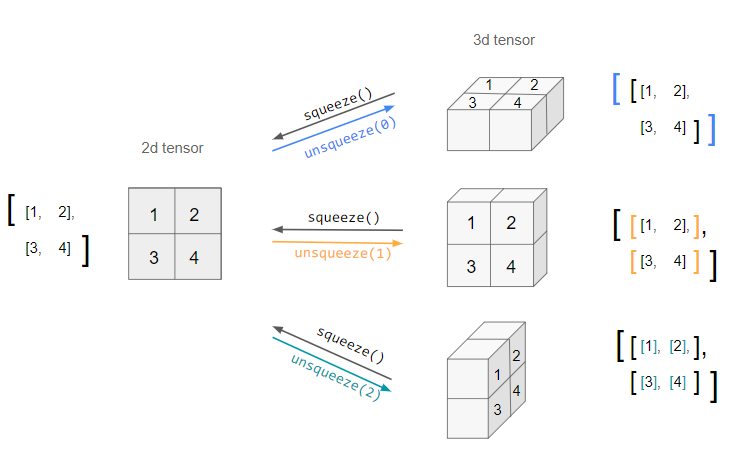
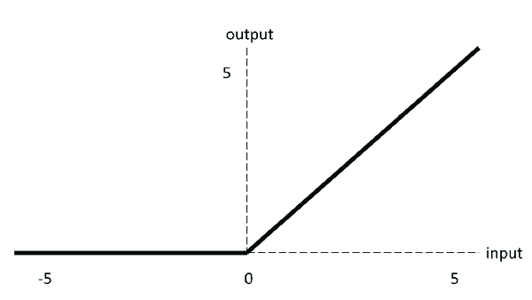

## Introduction to PyTorch
 
## Table of Contents :

- [Introduction to PyTorch](#introduction-to-pytorch)
- [Pytorch Tensor Understanding](#pytorch-tensor-understanding)
  - [Importing torch](#importing-torch)
  - [Creating Tensors](#creating-tensors)
  - [Creating Random Tensors](#creating-random-tensors)
  - [Creating zeros and ones tensor](#creating-zeros-and-ones-tensor)
  - [Creating tensor of a range](#creating-tensor-of-a-range)
  - [Tensor Manipulation](#tensor-manipulation)
  - [Element wise multiplication](#element-wise-multiplication)
  - [Min, Max, Sum, Mean ( Aggregation)](#min-max-sum-mean--aggregation)
  - [Changing tensor datatypes](#changing-tensor-datatypes)
  - [Shape Manipulation](#shape-manipulation)
    - [Reshaping](#reshaping)
  - [Squeeze](#squeeze)
  - [Unsqueeze](#unsqueeze)
  - [Indexing ( selecting data from tensors )](#indexing--selecting-data-from-tensors-)
  - [Creating tensors from numpy](#creating-tensors-from-numpy)
  - [Reproducibility](#reproducibility)
- [Dataset and Dataset Loader](#dataset-and-dataset-loader)
  - [Loading Dataset](#loading-dataset)
  - [Visualizing the dataset](#visualizing-the-dataset)
  - [Viewing a sample data](#viewing-a-sample-data)
  - [Lets plot random iamges](#lets-plot-random-iamges)
  - [Creating a Custom Dataset for out files](#creating-a-custom-dataset-for-out-files)
  - [Custom Dataset Class](#custom-dataset-class)
  - [Data loaders](#data-loaders)
- [Transforms](#transforms)
  - [v2 Transforms](#v2-transforms)
- [Creating a model and building](#creating-a-model-and-building)
  - [Defining the neural network class](#defining-the-neural-network-class)
- [Automatic  Differentitation with torch.autograd](#automatic--differentitation-with-torchautograd)
  - [Tensor Gradients and Jacobian Matrix](#tensor-gradients-and-jacobian-matrix)
- [Optimizing Model Parameters](#optimizing-model-parameters)
  - [Hyperparameters](#hyperparameters)
- [Loss function](#loss-function)
- [Optimizer](#optimizer)
    - [Gradient Descent Optimizer](#gradient-descent-optimizer)
- [Complete Neural Network in Pytorch](#complete-neural-network-in-pytorch)
  - [Loading the datasets](#loading-the-datasets)
  - [Seeing Datasize](#seeing-datasize)
  - [Finding total class in the datasets](#finding-total-class-in-the-datasets)
  - [Histogram Plot for each class data](#histogram-plot-for-each-class-data)
  - [Splitting Data into training and validation](#splitting-data-into-training-and-validation)
  - [Visualizing dataset](#visualizing-dataset)
  - [Creating Data loader](#creating-data-loader)
  - [Defining training and evaluating functions](#defining-training-and-evaluating-functions)
  - [Defining hyperparameters](#defining-hyperparameters)
  - [Selecting Loss Function and optimizer](#selecting-loss-function-and-optimizer)
  - [Model Training](#model-training)
- [Saving and Loading model](#saving-and-loading-model)
    - [Loading the model](#loading-the-model)


## Pytorch Tensor Understanding

### Importing torch


```python
import torch
print(torch.__version__)
```

    2.3.0+cpu


Tensors can be understood as data similar to Numpy Array.  
Tensor is a multi-dimensional matrix containing elements of a single data type.


Similar to numpy datatypes like np.int , np.uint8 and so on. We have datatypes for tensor as well.

| Datatype      | Description                                                                                         |
|---------------|-----------------------------------------------------------------------------------------------------|
| `float32`     | 32-bit floating point. Widely used for neural network weights and activations.                      |
| `float64`     | 64-bit floating point. Offers higher precision than `float32` but uses more memory.                 |
| `int32`       | 32-bit integer. Commonly used for indexing and integer operations.                                  |
| `int64`       | 64-bit integer. Used when higher range for integers is needed.                                       |
| `uint8`       | 8-bit unsigned integer. Often used for image data.                                                  |
| `bool`        | Boolean datatype. Used for binary operations and masks.                                             |
| `complex64`   | 64-bit complex number. Each complex number has two 32-bit floats for real and imaginary parts.      |
| `complex128`  | 128-bit complex number. Each complex number has two 64-bit floats for real and imaginary parts.     |
| `float16`     | 16-bit floating point. Used to reduce memory bandwidth, commonly in GPUs.                          |
| `bfloat16`    | 16-bit brain floating point. Similar to `float16`, used for efficient training of deep learning models. |


### Creating Tensors

**Creating Scalar**  
When we return the scalar and see that it is not just a regular number but a scalar.


```python
scalar  = torch.tensor(7)
scalar
```


    tensor(7)


**Checking the dimension shape and size of the scalar**


```python
print("the shape is {}".format(scalar.shape))
print("the size is {}".format(scalar.size()))
print("the number of dimension is {}".format(scalar.ndim))
print("the datatype is {}".format(scalar.dtype))
```

    the shape is torch.Size([])
    the size is torch.Size([])
    the number of dimension is 0
    the datatype is torch.int64


**Creating Vector**


```python
vector = torch.tensor([1,2,3])
vector
```


    tensor([1, 2, 3])


```python
print("the shape of vector is {}".format(vector.shape))
print("the size of vector is {}".format(vector.size()))
print("the number of dimension of vector is {}".format(vector.ndim))
print("the datatype of vector is {}".format(vector.dtype))
```

    the shape of vector is torch.Size([3])
    the size of vector is torch.Size([3])
    the number of dimension of vector is 1
    the datatype of vector is torch.int64


**Creating MATRIX**


```python
MY_MATRIX  = torch.tensor([[1,2,3],[4,5,6]])
```


```python
print("the shape of MY_MATRIX is {}".format(MY_MATRIX.shape))
print("the size of MY_MATRIX is {}".format(MY_MATRIX.size()))
print("the number of dimension of MY_MATRIX is {}".format(MY_MATRIX.ndim))
print("the datatype of MY_MATRIX is {}".format(MY_MATRIX.dtype))
```

    the shape of MY_MATRIX is torch.Size([2, 3])
    the size of MY_MATRIX is torch.Size([2, 3])
    the number of dimension of MY_MATRIX is 2
    the datatype of MY_MATRIX is torch.int64


**Creating Tensors**


```python
MY_TENSOR  = torch.tensor([[[1,2,3],[4,5,6],[7,8,9]]])

MY_TENSOR
```


    tensor([[[1, 2, 3],
             [4, 5, 6],
             [7, 8, 9]]])


```python
print("the shape of MY_TENSOR is {}".format(MY_TENSOR.shape))
print("the size of MY_TENSOR is {}".format(MY_TENSOR.size()))
print("the number of dimension of MY_TENSOR is {}".format(MY_TENSOR.ndim))
print("the datatype of MY_TENSOR is {}".format(MY_TENSOR.dtype))
```

    the shape of MY_TENSOR is torch.Size([1, 3, 3])
    the size of MY_TENSOR is torch.Size([1, 3, 3])
    the number of dimension of MY_TENSOR is 3
    the datatype of MY_TENSOR is torch.int64


Usually `scalar` and ` vector` are written in small letter and `MATRIX` and `TENSOR` are written in capital letter.


### Creating Random Tensors


```python
random_tensor = torch.rand(size = (1,3,4))
random_tensor , random_tensor.dtype
```


    (tensor([[[0.0149, 0.6417, 0.7417, 0.0225],
              [0.0724, 0.3692, 0.4785, 0.8048],
              [0.3059, 0.2675, 0.6245, 0.3675]]]),
     torch.float32)


Thus the default datatype for the tensor is float32

### Creating zeros and ones tensor

In below code if we want to create for one we use
* torch.ones()
* torch.ones_like()


```python
random_zero = torch.zeros(size = (1,3,4))
similar_zero = torch.zeros_like(random_tensor)
print(random_tensor)
print(similar_zero)
```

    tensor([[[0.0149, 0.6417, 0.7417, 0.0225],
             [0.0724, 0.3692, 0.4785, 0.8048],
             [0.3059, 0.2675, 0.6245, 0.3675]]])
    tensor([[[0., 0., 0., 0.],
             [0., 0., 0., 0.],
             [0., 0., 0., 0.]]])


### Creating tensor of a range


```python
range_tensor = torch.arange(1,10,0.5)
range_tensor
```


    tensor([1.0000, 1.5000, 2.0000, 2.5000, 3.0000, 3.5000, 4.0000, 4.5000, 5.0000,
            5.5000, 6.0000, 6.5000, 7.0000, 7.5000, 8.0000, 8.5000, 9.0000, 9.5000])


**torch.tensor parameters**

* `dtype` specifies the default datatypes for creating the tensor
* `device` specifies where the tensor  is created for,` CPU` or `GPU`
* `requires_grad` specifies if any operation performed on this tensor should be recorded or not.


So, when doing tensor calculations all the tensor should be present on the same dataypes and their shape should match. In case of different datatypes the datatypes can be converted to other type during operation.


```python
tensor_1 = torch.arange(1,10 ,dtype= torch.float16)
tensor_2 = torch.arange(1,10 ,dtype= torch.int)
print(tensor_1 * tensor_2)
```

    tensor([ 1.,  4.,  9., 16., 25., 36., 49., 64., 81.], dtype=torch.float16)


We can see the tensor_2 with `torch.int` datatype has been converted to `torch.float16` during the operation.

### Tensor Manipulation

All the operation done here is similar to Numpy.

Some of the operation are :

* Addition
* Subtraction
* Multiplication ( element wise)
* Division
* Matrix Multiplication


**Matrix operation**

When doing matrix multiplication we got an error saying that two tensor datatypes must match

```python
print( tensor_1 @ tensor_2)
```

RuntimeError: dot : expected both vectors to have same dtype, but found Half and Int

Lets create tensors of same datatypes


```python
tensor_1 = torch.arange(1,10,dtype= torch.float16)
tensor_2 = torch.rand(size = (1,9) , dtype= torch.float16 )

tensor_1.shape , tensor_2.shape
                        
```


    (torch.Size([9]), torch.Size([1, 9]))


If we look at the shape above one is of size [9] and other is of size[1,9]

Lets add extra dimension on the tensor 1 to make it suitable for element wise multiplication with tensor 2


```python
tensor_1 = tensor_1.unsqueeze(0)
tensor_1.shape
```


    torch.Size([1, 9])


We added an extra dimension, so now we can do element wise matrix multiplication


```python
tensor_3 = tensor_1 @ tensor_2.T
print(tensor_3)
```

    tensor([[29.5781]], dtype=torch.float16)


we did matrix multiplication of 1,9 and 9,1 so our obtained result was only 1

matrix multiplication can be visualized from this animation.


### Element wise multiplication


```python
print(tensor_1 * tensor_2)
```

    tensor([[0.1318, 0.3545, 2.8203, 3.4727, 4.4609, 4.5352, 0.5195, 5.1406, 8.1484]],
           dtype=torch.float16)


### Min, Max, Sum, Mean ( Aggregation)


```python
random_tensor = torch.rand(size = (2,2))
random_tensor
```


    tensor([[0.6412, 0.9325],
            [0.7639, 0.3909]])


```python
print(f"Minimum: {random_tensor.min()}")
print(f"Maximum: {random_tensor.max()}")
print(f"Mean: {random_tensor.mean()}") 
print(f"Sum: {random_tensor.sum()}")
```

    Minimum: 0.39085549116134644
    Maximum: 0.932500958442688
    Mean: 0.6821336150169373
    Sum: 2.728534460067749


Get the index of min and max element


```python
random_tensor = torch.rand(size = (1,2,2))
random_tensor
```


    tensor([[[0.7992, 0.5631],
             [0.2071, 0.9525]]])


```python
print(' Max index  :  {}'.format(torch.argmax(random_tensor)))
print(' Min index  :  {}'.format(torch.argmin(random_tensor)))
```

     Max index  :  3
     Min index  :  2


### Changing tensor datatypes


```python
random_tensor = torch.rand(size = (2,3,3))
print(random_tensor.dtype)
print(random_tensor)
```

    torch.float32
    tensor([[[0.8036, 0.8263, 0.2026],
             [0.8496, 0.0121, 0.6435],
             [0.6814, 0.2488, 0.6751]],
    
            [[0.1543, 0.0226, 0.7537],
             [0.7958, 0.4441, 0.0572],
             [0.0841, 0.5091, 0.9720]]])


```python
changed_random = random_tensor.type(torch.int8)
print(changed_random.dtype)
print(changed_random)
```

    torch.int8
    tensor([[[0, 0, 0],
             [0, 0, 0],
             [0, 0, 0]],
    
            [[0, 0, 0],
             [0, 0, 0],
             [0, 0, 0]]], dtype=torch.int8)


### Shape Manipulation

| Method                      | One-line description                                                                                   |
|-----------------------------|-------------------------------------------------------------------------------------------------------|
| `torch.reshape(input, shape)` | Reshapes input to shape (if compatible), can also use `torch.Tensor.reshape()`.                        |
| `Tensor.view(shape)`         | Returns a view of the original tensor in a different shape but shares the same data as the original tensor. |
| `torch.stack(tensors, dim=0)` | Concatenates a sequence of tensors along a new dimension (`dim`), all tensors must be same size.       |
| `torch.squeeze(input)`       | Squeezes input to remove all the dimensions with value 1.                                             |
| `torch.unsqueeze(input, dim)` | Returns input with a dimension value of 1 added at `dim`.                                             |
| `torch.permute(input, dims)` | Returns a view of the original input with its dimensions permuted (rearranged) to `dims`.              |


#### Reshaping


```python
original_tensor = torch.rand(size = (2,5))
print("The original tensor is : ")
print(original_tensor)
reshaped_tensor = original_tensor.reshape(1,10)
print("The reshaped tensor is : ")
print(reshaped_tensor)
```

    The original tensor is : 
    tensor([[0.6852, 0.5569, 0.1607, 0.5117, 0.2165],
            [0.4890, 0.0346, 0.2188, 0.3473, 0.0351]])
    The reshaped tensor is : 
    tensor([[0.6852, 0.5569, 0.1607, 0.5117, 0.2165, 0.4890, 0.0346, 0.2188, 0.3473,
             0.0351]])


### Squeeze

this removes the dimension with value 1

For example , lets create a tensor of shape (1,2,2) then when we do squeeze we get the shape only (2,2) 


```python
org_tensor = torch.rand(size= (1,2,2))
print(org_tensor.shape)
squeezed_tensor = org_tensor.squeeze()
print(squeezed_tensor.shape)
```

    torch.Size([1, 2, 2])
    torch.Size([2, 2])


### Unsqueeze

this adds extra dimension
Lets increase the dimension of the previously squeezed tensor


```python
unsqueezed_tensor = squeezed_tensor.unsqueeze(0)
# we are adding extra dimenison in the 0th index
print(unsqueezed_tensor.shape)
```

    torch.Size([1, 2, 2])


The squeeze and unsqueeze operation can be viewed from this image



### Indexing ( selecting data from tensors )


```python
random_tensor = torch.rand( size= (2,3,3))
random_tensor
```


    tensor([[[0.6382, 0.9186, 0.8303],
             [0.6624, 0.6489, 0.2965],
             [0.0218, 0.4689, 0.2544]],
    
            [[0.8418, 0.4448, 0.3435],
             [0.4243, 0.2063, 0.1817],
             [0.6568, 0.8159, 0.5948]]])


lets get the first columns of each matrix


```python
random_tensor[:,:,0]
```


    tensor([[0.6382, 0.6624, 0.0218],
            [0.8418, 0.4243, 0.6568]])


Lets get the first row of each matrix


```python
random_tensor[ : , 0 , :]
```


    tensor([[0.6382, 0.9186, 0.8303],
            [0.8418, 0.4448, 0.3435]])


`torch.view()`

It keeps the data as original but changes the view i.e changes the dimension when displaying.

The view doesn't return the copy. It is linked to the original data, so any changes in the view data will br reflected in the original


```python
my_tensor = torch.zeros((2,3))
my_tensor
```


    tensor([[0., 0., 0.],
            [0., 0., 0.]])


```python
view_tensor =  my_tensor.view(1,6)
view_tensor
```


    tensor([[0., 0., 0., 0., 0., 0.]])


Lets change the view_tensor and see what happens to the original tensor


```python
view_tensor[0,5] = 1
view_tensor
```


    tensor([[0., 0., 0., 0., 0., 1.]])


```python
my_tensor
```


    tensor([[0., 0., 0.],
            [0., 0., 1.]])


So changes done in `view_tensor` is also seen in `my_tensor`

### Creating tensors from numpy


```python
import numpy as np

array1 = np.random.rand(3,5)
array1
```


    array([[0.92161495, 0.10025034, 0.70069907, 0.08066198, 0.45905316],
           [0.2365478 , 0.89373517, 0.80907389, 0.89185386, 0.0930916 ],
           [0.62981711, 0.74420844, 0.06250636, 0.36513678, 0.45218504]])


```python
tensor1 = torch.tensor(array1)
tensor1
```


    tensor([[0.9216, 0.1003, 0.7007, 0.0807, 0.4591],
            [0.2365, 0.8937, 0.8091, 0.8919, 0.0931],
            [0.6298, 0.7442, 0.0625, 0.3651, 0.4522]], dtype=torch.float64)


The tensor created has utilized the datatype from the numpy array


### Reproducibility

Sometimes we want to create random number and then use it reproduce result in such case we use 

`torch.manual_seed(seed = RANDOM_SEED)`


```python
RANDOM_SEED = 199
torch.random.manual_seed(seed= RANDOM_SEED)
random_tensor = torch.rand(size = (5,5))
random_tensor
```


    tensor([[0.6267, 0.1686, 0.4021, 0.7782, 0.3756],
            [0.0933, 0.1031, 0.7099, 0.7436, 0.2095],
            [0.4798, 0.6020, 0.5863, 0.6574, 0.9502],
            [0.9318, 0.1348, 0.8016, 0.8189, 0.2967],
            [0.6419, 0.5061, 0.5140, 0.3459, 0.5607]])


```python
RANDOM_SEED = 199
torch.random.manual_seed(seed= RANDOM_SEED)
random_tensor = torch.rand(size = (5,5))
random_tensor
```


    tensor([[0.6267, 0.1686, 0.4021, 0.7782, 0.3756],
            [0.0933, 0.1031, 0.7099, 0.7436, 0.2095],
            [0.4798, 0.6020, 0.5863, 0.6574, 0.9502],
            [0.9318, 0.1348, 0.8016, 0.8189, 0.2967],
            [0.6419, 0.5061, 0.5140, 0.3459, 0.5607]])


We are able to produce the same random tensor which will be useful in reproducing the result that we want in future

## Dataset and Dataset Loader

### Loading Dataset


```python
import torch
from torch.utils.data import Dataset
from torchvision import datasets
from torchvision.transforms import ToTensor
import matplotlib.pyplot as plt


training_data = datasets.FashionMNIST(
    root="data",
    train=True,
    download=True,
    transform=ToTensor()
)

test_data = datasets.FashionMNIST(
    root="data",
    train=False,
    download=True,
    transform=ToTensor()
)
```

Lets understand the different parameters given to the loaddataset

`root` this is the path where our data will be downloaded to

`train` denotes we want to return train data or not. Meaning want to return test or train data

`download` the dataset loader checks the `root` path for the dataset, if its not available then downlaods from the internet

`transform`and `target_transform` specify the trasnformaiton that we want to apply to the label or features


### Visualizing the dataset


```python
training_data
```


    Dataset FashionMNIST
        Number of datapoints: 60000
        Root location: data
        Split: Train
        StandardTransform
    Transform: ToTensor()


### Viewing a sample data


```python
img,label = training_data[0] 
plt.imshow(img[0], cmap= "gray")
plt.show()
```


    

    


```python
img,label = training_data[0]
img.shape
```


    torch.Size([1, 28, 28])


`To remove the first dimension 1, we use squeeze and plot the image`

### Lets plot random iamges


```python
figure = plt.figure(figsize=(8, 8))
cols, rows = 3, 3
for i in range(1, cols * rows + 1):
    sample_idx = torch.randint(len(training_data), size=(1,)).item()
    img, label = training_data[sample_idx]
    figure.add_subplot(rows, cols, i)
    plt.axis("off")
    plt.imshow(img.squeeze(), cmap="gray") 
plt.show()
```


    

    


### Creating a Custom Dataset for out files

lets analyze the training_data and its various methods


```python
training_data.__dict__
```


    {'root': 'data',
     'transform': ToTensor(),
     'target_transform': None,
     'transforms': StandardTransform
     Transform: ToTensor(),
     'train': True,
     'data': tensor([[[0, 0, 0,  ..., 0, 0, 0],
              [0, 0, 0,  ..., 0, 0, 0],
              [0, 0, 0,  ..., 0, 0, 0],
              ...,
              
             [[0, 0, 0,  ..., 0, 0, 0],
              [0, 0, 0,  ..., 0, 0, 0],
              [0, 0, 0,  ..., 0, 0, 0],
              ...,
              [0, 0, 0,  ..., 0, 0, 0],
              [0, 0, 0,  ..., 0, 0, 0],
              [0, 0, 0,  ..., 0, 0, 0]]], dtype=torch.uint8),
     'targets': tensor([9, 0, 0,  ..., 3, 0, 5])}


### Custom Dataset Class

Lets say we have a txt file that has image path and label of the image. such as shown below :


There are two image data inside the `data` folder and thier label and image path name is contained in `data.txt`

**Data.txt**
> cat.jpg cat  
> dog.jpg dog

Lets create our own dataset class to deal with such data


```python
import os
import pandas as pd
from torch.utils.data import Dataset
from torchvision.io import read_image
import torchvision.transforms as T

class my_dataset(Dataset):
    def __init__(self, data_file, transform=None, target_transform=None , width = 100 , height = 200):
        self.img_paths, self.img_labels = self.read_data(data_file)
        self.transform = transform
        self.target_transform = target_transform
        self.width = width
        self.height = height

    def read_data(self, txt_path):
        img_path_list = []
        img_label_list = []
        with open(txt_path, "r") as file:
            data = file.readlines()
            for line in data:
                word = line.split()
                img_path_list.append('custom_dataset/data/' + word[0])
                img_label_list.append(word[1])

        return img_path_list,img_label_list

    def __len__(self):
        return len(self.img_labels)

    def __getitem__(self, idx):
        img_path = self.img_paths[idx]
        image = read_image(img_path) 
        label = self.img_labels[idx]
        if self.transform:
            image = self.transform(image)
        if self.target_transform:
            label = self.target_transform(label)
        return image, label
```

**lets check our class**


```python
image_dataset = my_dataset('custom_dataset/data.txt')
image, label = image_dataset.__getitem__(idx= 0)
image.shape
```


    torch.Size([3, 736, 655])


We can see the shape is (3,736,635) lets permute the shape to (736,635,3)


```python
image = torch.permute(image, (1,2,0))
image.shape
```


    torch.Size([736, 655, 3])


```python
plt.imshow(image)
plt.title(label)
```


    Text(0.5, 1.0, 'cat')


    

    


Instead of manually doing this we can pass the transform to the dataset class. So each image will be transformed before returning.

We will make the data loader return the same image size and perform torch.permute value


```python
width, height = 500,500

my_transform = T.Compose([
    T.ToPILImage(),                # Convert tensor to PIL image
    T.Resize((height, width)),     # Resize the image
    T.ToTensor()                   # Convert PIL image back to tensor
])
```


```python
image_dataset = my_dataset('custom_dataset/data.txt', transform= my_transform)
image, label = image_dataset.__getitem__(idx= 0)
image.shape
```


    torch.Size([3, 500, 500])


### Data loaders

The dataset class that we created above returns our data one at a time. And during training we want to pass the dataset in minibatches with shuffling done every time we want the data.datasets
For this we use Dataloader

For this we will pass our own custom dataset to the loader. And we can get our data in batches through the loader and with our own transform applied to it.


```python
from torch.utils.data import DataLoader
training_dataloader = DataLoader(image_dataset, batch_size= 2 , shuffle= True)

```

So to pass the dataset to the dataloader our
```python
class dataset()
```

must have three methods which are

* __init__  
This is the funciton which runs once we instantiate the Dataset object.

* __len__  
returns the length of the dataset

* __getitem__
This loads and returns the dataset of a given index.


```python
first_batch = next(iter(training_dataloader))
```

Lets plot the first batch

We know we have given a batch size of 2 , so in each batch there will be 2 images along with their labels.


```python
len(first_batch)
```


    2


The above first_batch has length of `two`. One contains the image and another contains the label 


```python
plt.imshow(torch.permute(first_batch[0][0], (1,2,0)))
plt.title(first_batch[1][0])       # image array
```


    Text(0.5, 1.0, 'dog')


    

    


```python
plt.imshow(torch.permute(first_batch[0][1], (1,2,0)))
plt.title(first_batch[1][1])       # image array
```


    Text(0.5, 1.0, 'cat')


    

    


So we just created our own custom dataset and passed it to the dataloader

## Transforms

When creating out custom dataset , we had kept the `transform` and `target transform` . These two will be used to manipulate the data and their label. Since the data wont be availble in final processed form. It is better to pass the transform to the dataset than to hardcode the transform as it may differ from project to project.
So we use `torchvision.transforms`to tackle this problem.

When we load the fashion mnist dataset. Our image should be in tensor format. Initially the dataset is in PIL format. And if we wish to perform one hot encoding on the label then we can do it as follows


`ToTensor()`

ToTensor converts a PIL image or NumPy ndarray into a FloatTensor. and scales the image’s pixel intensity values in the range [0., 1.]


`Lambda Transforms`

Lambda transforms apply any user-defined lambda function.
It allows us to use the `lambda` function. We wanted to convert the labels to one hot encoded format. instead of creating a seperate function and mapping the whole datasets we can create a lambda function and perform the function inside.

So first we created a zeros of length 10 and then added 1 in the index given in the labels. 


```python
import torch
from torchvision import datasets
from torchvision.transforms import ToTensor,Lambda
```


```python
fashion_dataset = datasets.FashionMNIST(
    root= "data",
    train= True,
    download = False,
    transform = ToTensor(),
    target_transform= Lambda(lambda y : torch.zeros(10,dtype = torch.float).scatter_(0,torch.tensor(y),value = 1) )
)
```


```python
img,label = fashion_dataset.__getitem__(100)
print(img.type)
print(label)
```

    <built-in method type of Tensor object at 0x7f2ce65a9530>
    tensor([0., 0., 0., 0., 0., 0., 0., 0., 1., 0.])


Thus with the help of transform we were able to modify the whole dataset without transforming all data and store it somewhere whcih would have been space consuming.

If we want to stack different transforms together then we can do it through `torchvision.transforms.compose`

### v2 Transforms

For better and faster transform capability instead of just `torchvision.transforms` we can use `torchvision.transforms.v2`

The advantage of `v2` over `torchvision.transforms` are listed below :


    They can transform images but also bounding boxes, masks, or videos. This provides support for tasks beyond image classification: detection, segmentation, video classification, etc.

    They support more transforms like CutMix and MixUp. 

    They’re faster.

    They support arbitrary input structures (dicts, lists, tuples, etc.).

    Future improvements and features will be added to the v2 transforms only.


```python
from torchvision import transforms as v2 

# Define the transformations using torchvision's Compose
transform = v2.Compose([
    v2.ToPILImage(),               # Convert tensor to PIL image
    v2.Resize((height, width)),    # Resize the image
    v2.ToTensor(),                 # Convert PIL image to tensor
    v2.Lambda(lambda x: x.permute(1, 2, 0))  # Permute the dimensions
])

# Assuming my_dataset and my_transform are defined elsewhere
image_dataset = my_dataset('custom_dataset/data.txt', transform=transform)
image, label = image_dataset.__getitem__(idx=0)
plt.imshow(image)
plt.title(label)

```


    Text(0.5, 1.0, 'cat')


    

    

## Creating a model and building

We will be building a neural network in pytorch. we will be using `torch.nn` for this task


```python
import os
import torch
from torch import nn
from torch.utils.data import DataLoader
from torchvision import datasets,transforms 
```


```python
device = (
    "cuda"
    if torch.cuda.is_available()
    else "mps"
    if torch.backends.mps.is_available()
    else "cpu"
)
device
```


    'cpu'


### Defining the neural network class

Lets create a Neural class, that takes input of image size 28*28 and produces forward pass output passed through relu activiated two layers.


```python
class Neural(nn.Module):
    def __init__(self) :
        super().__init__()
        self.flatten = nn.Flatten()
        self.linear_layers = nn.Sequential(
            nn.Linear(28*28 , 512),
            nn.ReLU(),
            nn.Linear(512,512),
            nn.ReLU(),
            nn.Linear(512,10),
        )

    def forward(self,x):
        x = self.flatten(x)
        logits = self.linear_layers(x)
        return logits
```

`nn.Flatten` does similar to what `np.flatten` does. It flattens out high dimensional data to a single dimension.  


```python
random_images = torch.rand(3,28,28)
flattener = nn.Flatten()
flattened_output =  flattener(random_images)
flattened_output.shape
```


    torch.Size([3, 784])


We can see the `nn.Flatten()` maintained the dimension `0`. If we want to flatten all the dimension it can be done as 


```python
all_flattened = nn.Flatten(start_dim=0, end_dim= -1)(random_images)
all_flattened.shape
```


    torch.Size([2352])


Another layer is the `nn.Linear`. It applies a linear transformation to the input with its strored weight. Lets see the result.


```python
linear_transformer = nn.Linear(in_features= 28*28 , out_features = 1 )
linear_output = linear_transformer(flattened_output)
linear_output.shape
```


    torch.Size([3, 1])


It produces output of three random images data. Lets see the weight 


```python
linear_transformer.weight[0,:20]
```


    tensor([ 0.0042, -0.0143,  0.0022, -0.0019, -0.0183,  0.0071,  0.0328,  0.0285,
             0.0319, -0.0218,  0.0269, -0.0107, -0.0237, -0.0081,  0.0331, -0.0292,
             0.0155,  0.0312,  0.0289, -0.0017], grad_fn=<SliceBackward0>)


```python
linear_transformer.weight.shape
```


    torch.Size([1, 784])


And another is nn.ReLU , it just applies relu function to the input.



To combine all the function together, we use Sequential. the data will be passed in the order as defined.

Now lets create a model and compute the `forward pass`


```python
model = Neural().to(device)
print(model)
```

    Neural(
      (flatten): Flatten(start_dim=1, end_dim=-1)
      (linear_layers): Sequential(
        (0): Linear(in_features=784, out_features=512, bias=True)
        (1): ReLU()
        (2): Linear(in_features=512, out_features=512, bias=True)
        (3): ReLU()
        (4): Linear(in_features=512, out_features=10, bias=True)
      )
    )


I have created two random images, one is a random numpy array and another is random tensor. When we pass the random image to the model.flatten(). We can see that the numpy array isn't supported so we must pass tensor to the function. And the `device` the tensor is created should also match.


```python
import numpy as np
import matplotlib.pyplot as plt

Y = np.random.rand(1,28,28) # we can't pass this to torch flatten function. We need a tensor
X = torch.rand(1, 28, 28, device=device)
plt.imshow(X[0])
```


    <matplotlib.image.AxesImage at 0x7b1df515cc10>


    

    


```python
input_to_model = model.flatten(X)
input_to_model.shape
```


    torch.Size([1, 784])


```python
final_output = model.linear_layers(input_to_model)
final_output.shape
```


    torch.Size([1, 10])


Thus our random image, final output is the output of the 10 final units. Now if we are doing a classification task we pass it to the softmax function


```python
final_probability = nn.Softmax(dim= 1)(final_output)
print(final_probability)
```

    tensor([[0.1042, 0.1034, 0.0960, 0.0912, 0.1033, 0.0918, 0.0978, 0.1060, 0.1074,
             0.0989]], grad_fn=<SoftmaxBackward0>)


```python
final_probability.shape
```


    torch.Size([1, 10])


We get a tensor that contains our probability of each class. So lets ge the index of max probability


```python
predicted_class = final_probability.argmax(1)
predicted_class
```


    tensor([8])


## Automatic  Differentitation with torch.autograd

We know once we do forward pass, we get the output now to update the weights of the Linear layers, which we saw earlier. For each layer there is weight connecting the previous nodes and current nodes as well as there are bias terms. To update them we take derivative of the `Cost` function with the weights and calulate the gradient which will be further used to update them.


To do this , pytorch has differentiation calulation enginer called torch.autograd which automatically computes the gradient for the computation graph.

Lets peform a simple forward pass, which will be based on the fig shown below :


Lets assume the input consist of data having 5 feature.

And there is only one output node


We will conside the activation function to be just linear in this case


```python
x = torch.rand(1,5)
w = torch.rand(5,1 ,requires_grad= True )
b = torch.rand(1 , requires_grad= True)
z = x @ w + b
```

Lets say our actual target is `y` = 1.5. and lets take absolute error as loss metric


```python
y = torch.tensor(1.5)
loss = y - z
```

Now if we want to find the gradient of `w` and `b` with the obtained loss. It can be done through loss.backward() . It calculates the $`\frac{\partial L}{\partial w}`$ and $`\frac{\partial L}{\partial b}`$


```python
loss.backward()
```

Lets see the gradients of the weight matrix.


```python
w.grad
```


    tensor([[-0.3561],
            [-0.1812],
            [-0.4725],
            [-0.0305],
            [-0.5495]])


Similarly lets see the gradients of the bias matrix


```python
b.grad
```


    tensor([-1.])


Note 
> 
    We can only obtain the grad properties for the leaf nodes of the computational graph, which have requires_grad property set to True. For all other nodes in our graph, gradients will not be available.

    We can only perform gradient calculations using backward once on a given graph, for performance reasons. If we need to do several backward calls on the same graph, we need to pass retain_graph=True to the backward call.


Once we train the network, we only need to predict. So, we no longer need to calculate the gradient .Thus, we do the following :


```python
z = torch.matmul(x, w)+b
print(z.requires_grad)

with torch.no_grad():
    z = torch.matmul(x, w)+b
print(z.requires_grad)
```

    True
    False


We can use `z.detach()` as well to make the `requires_grad` set to `False`.

### Tensor Gradients and Jacobian Matrix

If we have output function as arbitrary tensor instead of scalar loss funciton. In this case , we can calulate the jacobian product instead of the actual gradient.

For a vector function $`\vec{y} = f(\vec{x})`$, where $`\vec{x} = \langle x_1, \ldots, x_n \rangle `$  and $` \vec{y} = \langle y_1, \ldots, y_m \rangle `$, a gradient of $`\vec{y}`$ with respect to $`\vec{x}`$ is given by the **Jacobian matrix**:


 

```math
J = \begin{pmatrix}
\frac{\partial y_1}{\partial x_1} & \cdots & \frac{\partial y_1}{\partial x_n} \\
\vdots & \ddots & \vdots \\
\frac{\partial y_m}{\partial x_1} & \cdots & \frac{\partial y_m}{\partial x_n}
\end{pmatrix}
```

Instead of computing the Jacobian matrix itself, PyTorch allows you to compute the **Jacobian Product** $` \vec{v}^T \cdot J `$ for a given input vector $` \vec{v} = \langle v_1, \ldots, v_m \rangle `$. This is achieved by calling `backward` with $` \vec{v} `$ as an argument. The size of $` \vec{v} `$ should be the same as the size of the original tensor, with respect to which we want to compute the product.

```python
inp = torch.eye(4, 5, requires_grad=True)
inp
```
 
    tensor([[1., 0., 0., 0., 0.],
            [0., 1., 0., 0., 0.],
            [0., 0., 1., 0., 0.],
            [0., 0., 0., 1., 0.]], requires_grad=True)

```python
out = (inp+1).pow(2).t()
out.backward(torch.ones_like(out), retain_graph=True)
print(f"First call\n{inp.grad}")
out.backward(torch.ones_like(out), retain_graph=True)
print(f"\nSecond call\n{inp.grad}")
inp.grad.zero_()
out.backward(torch.ones_like(out), retain_graph=True)
print(f"\nCall after zeroing gradients\n{inp.grad}")
```


### First Call


1. **Forward Pass**:
   - `inp` is a $` 4 \times 5 `$ identity matrix.
   - `out = (inp + 1).pow(2)` results in:
```math
     \begin{pmatrix}
     4 & 1 & 1 & 1 & 1 \\
     1 & 4 & 1 & 1 & 1 \\
     1 & 1 & 4 & 1 & 1 \\
     1 & 1 & 1 & 4 & 1
     \end{pmatrix}
```
   - This is because $`(1+1)^2 = 4`$ and $`(0+1)^2 = 1`$.

2. **Backward Pass**:
   - When calling `out.backward(torch.ones_like(out), retain_graph=True)`, PyTorch computes the gradient of `out` w.r.t. `inp`.
   - Given $` y = (x+1)^2 `$, the derivative $` y' = 2(x+1) `$.
   - Thus, the gradient for each element of `inp` is `2 * (inp + 1)`:
 ```math
     \begin{pmatrix}
     4 & 2 & 2 & 2 & 2 \\
     2 & 4 & 2 & 2 & 2 \\
     2 & 2 & 4 & 2 & 2 \\
     2 & 2 & 2 & 4 & 2
     \end{pmatrix}
 ```

### Second Call

The second call to `out.backward(torch.ones_like(out), retain_graph=True)` happens without zeroing the gradients.

1. **Accumulation of Gradients**:
   - PyTorch accumulates gradients by default. This means the new gradients are added to the existing gradients stored in `inp.grad`.
   - The new gradients computed in the second call are the same as in the first call:
```math
     \begin{pmatrix}
     4 & 2 & 2 & 2 & 2 \\
     2 & 4 & 2 & 2 & 2 \\
     2 & 2 & 4 & 2 & 2 \\
     2 & 2 & 2 & 4 & 2
     \end{pmatrix}
 ```
   - These are added to the gradients from the first call:
```math
     \begin{pmatrix}
     4 & 2 & 2 & 2 & 2 \\
     2 & 4 & 2 & 2 & 2 \\
     2 & 2 & 4 & 2 & 2 \\
     2 & 2 & 2 & 4 & 2
     \end{pmatrix}
     +
     \begin{pmatrix}
     4 & 2 & 2 & 2 & 2 \\
     2 & 4 & 2 & 2 & 2 \\
     2 & 2 & 4 & 2 & 2 \\
     2 & 2 & 2 & 4 & 2
     \end{pmatrix}
     =
     \begin{pmatrix}
     8 & 4 & 4 & 4 & 4 \\
     4 & 8 & 4 & 4 & 4 \\
     4 & 4 & 8 & 4 & 4 \\
     4 & 4 & 4 & 8 & 4
     \end{pmatrix}
```

### Third Call

Before the third call, you zero out the gradients using `inp.grad.zero_()`.

1. **Zeroing Gradients**:
   - This resets the gradients stored in `inp.grad` to zero.

2. **Backward Pass**:
   - When you call `out.backward(torch.ones_like(out), retain_graph=True)` again, PyTorch computes the gradients anew.
   - The gradients computed are the same as in the first call:
   ```math
     \begin{pmatrix}
     4 & 2 & 2 & 2 & 2 \\
     2 & 4 & 2 & 2 & 2 \\
     2 & 2 & 4 & 2 & 2 \\
     2 & 2 & 2 & 4 & 2
     \end{pmatrix}
     ```

Since the gradients were reset before this call, the final gradient stored in `inp.grad` is exactly the same as the gradients computed during this call, without any accumulation.


## Optimizing Model Parameters

To optimize the model parameters gradient descent is done on the function whose lose function is convex and differentiable.  
Lets combine all the codes that we did till now and train a simple Fashion Mnist classification model

### Hyperparameters 

They inturn control the parameters of the model. They are adjustable unlike the model parameters and we perform hyperparameter tuning for the best results.

Some of the hyper parameters are :

* epochs : times to iterate over the dataset
* batch size : number of dataset to be included in a training at a time
* learning rate : contribution of gradients in updating model parameters

## Loss function

It measures the degree of dissimilarity of obtained result to the target value, and it is the loss function that we want to minimize during training. By differentiating the loss function with the variables that we want to update we can calculate their gradient.

some of the loss function are :

| Loss Function                 | Description                                                                                      | Mathematical Formula                                                                                             |
|-------------------------------|--------------------------------------------------------------------------------------------------|-----------------------------------------------------------------------------------------------------------------|
| `nn.CrossEntropyLoss`         | Combines `nn.LogSoftmax` and `nn.NLLLoss` in one single class. It is useful for classification tasks. | $` \text{CrossEntropy}(x, y) = - \sum_{i} y_i \log \left(\frac{\exp(x_i)}{\sum_j \exp(x_j)}\right)`$              |
| `nn.MSELoss`                  | Mean Squared Error Loss. Measures the average of the squares of the errors or deviations.         | $`\text{MSE}(x, y) = \frac{1}{n} \sum_{i=1}^n (x_i - y_i)^2`$                                                    |
| `nn.BCELoss`                  | Binary Cross Entropy Loss. It is used for binary classification tasks.                           | $`\text{BCE}(x, y) = -\frac{1}{n} \sum_{i=1}^n [y_i \log(x_i) + (1 - y_i) \log(1 - x_i)]`$                       |
| `nn.BCEWithLogitsLoss`        | Combines a `Sigmoid` layer and the `BCELoss` in one single class.                                | $`\text{BCEWithLogits}(x, y) = \text{BCE}(\sigma(x), y)`$ where $`\sigma(x) = \frac{1}{1 + \exp(-x)}`$           |
 
 

## Optimizer

Gradient descent is one of the optimizer that we use in adjusting the model parameters to reduce the model error in each training step.

Once we find the gradient of parameters with respect to the loss function. We pass the gradients to the optimizers and it updates the parameters of the model.

Some of the optimizers are :

* Gradient Descent
* Stochastic Gradient Descent
* ADAM
* RMSProp


#### Gradient Descent Optimizer
 
Gradient descent is an iterative optimization algorithm widely employed in machine learning to minimize a cost or loss function. The objective is to find the values of model parameters that result in the lowest possible cost. The algorithm begins with an initial guess for the parameters and iteratively updates them by moving in the direction opposite to the steepest ascent of the cost function, as indicated by the gradient. The update is proportional to the negative gradient and is controlled by a learning rate, determining the step size at each iteration. This process continues until convergence, where the change in parameters becomes negligible, signifying a minimum or plateau. The learning rate is a critical factor, influencing the algorithm's convergence speed and stability.


**Types of Gradient Descent:**

* `Batch Gradient Descent`: Updates are made using the entire dataset.

* `Stochastic Gradient Descent (SGD)`: Updates are made using only one randomly chosen data point at a time.

* `Mini-batch Gradient Descent`: Updates are made using a small random subset of the dataset.


Lets call the `Stochastic Gradient Descent` optimizer

```python
optimizer = torch.optim.SGD(model.parameters(), lr= learning_rate)
```

If we want to reset the gradient of model parameters to zero, then we do

```python
optimizer.zero_grad()
```

## Complete Neural Network in Pytorch


```python
import torch
from torch import nn
import matplotlib.pyplot as plt
```

### Loading the datasets


```python
from torchvision import datasets
from torchvision.transforms import ToTensor

# Download training data from open datasets.
training_data = datasets.FashionMNIST(
    root="data",
    train=True,
    download=True,
    transform=ToTensor(), # Read file and convert image to Tensor
)

# Download test data from open datasets.
test_data = datasets.FashionMNIST(
    root="data",
    train=False,
    download=True,
    transform=ToTensor(),
)
```

### Seeing Datasize 


```python
print(training_data.data.shape)
print(test_data.data.shape)
```

    torch.Size([60000, 28, 28])
    torch.Size([10000, 28, 28])


```python
training_data.__dict__ 
```


    {'root': 'data',
     'transform': ToTensor(),
     'target_transform': None,
     'transforms': StandardTransform
     Transform: ToTensor(),
     'train': True,
     'data': tensor([[[0, 0, 0,  ..., 0, 0, 0],
              [0, 0, 0,  ..., 0, 0, 0],
              [0, 0, 0,  ..., 0, 0, 0],
              ...,
              [0, 0, 0,  ..., 0, 0, 0],
              [0, 0, 0,  ..., 0, 0, 0],
              [0, 0, 0,  ..., 0, 0, 0]],
     
             [[0, 0, 0,  ..., 0, 0, 0],
              [0, 0, 0,  ..., 0, 0, 0],
              [0, 0, 0,  ..., 0, 0, 0],
              ...,
              [0, 0, 0,  ..., 0, 0, 0],
              [0, 0, 0,  ..., 0, 0, 0],
              [0, 0, 0,  ..., 0, 0, 0]]], dtype=torch.uint8),
     'targets': tensor([9, 0, 0,  ..., 3, 0, 5])}


```python
training_data.targets.shape
```


    torch.Size([60000])


### Finding total class in the datasets


```python
n_classes = len(torch.unique(training_data.targets))
print("The total classes in the dataset is : {} ".format(len(torch.unique(training_data.targets))))
```

    The total classes in the dataset is : 10 


### Histogram Plot for each class data

We can see from the histogram plot below all the classes are equally distributed


```python
plt.hist(training_data.targets, bins= 20)
plt.show()
```


    

    


### Splitting Data into training and validation


```python
training_data, val_data = torch.utils.data.random_split(training_data, [50000, 10000])
print(len(training_data.indices))
print(len(val_data.indices))
```

    50000
    10000


```python
training_data
```


    <torch.utils.data.dataset.Subset at 0x76bd80cd1cf0>


### Visualizing dataset


```python
# plot first few images
plt.figure(figsize=(10,10))
for i in range(10):
  plt.subplot(5,5,i+1)
  plt.xticks([])
  plt.yticks([])
  plt.imshow(training_data[i][0][0], cmap=plt.cm.binary) 
  plt.title(training_data[i][1]) 
plt.show() 
```


    

    


### Creating Data loader


```python
batch_size = 128

from torch.utils.data import DataLoader

# we shuffle during training only
train_dataloader = DataLoader(training_data, batch_size=batch_size, shuffle=True)
val_dataloader = DataLoader(val_data, batch_size=batch_size)
test_dataloader = DataLoader(test_data, batch_size=batch_size)
```

### Defining training and evaluating functions


```python
def train_loop(dataloader, model, loss_fn, optimizer):
    size = len(dataloader.dataset)

    model.train()
    
    for batch, (X, y) in enumerate(dataloader):
        # Compute prediction and loss
        pred = model(X)
        loss = loss_fn(pred, y)

        # Backpropagation
        loss.backward() # Perform backward propagation
        optimizer.step()  # Perform gradient update
        optimizer.zero_grad() # Remove any previous gradient calculation done by optimizer
         

        if batch % 100 == 0:
            loss, current = loss.item(), batch * batch_size + len(X)
            print(f"loss: {loss:>7f}  [{current:>5d}/{size:>5d}]")


def val_loop(dataloader, model, loss_fn):

    model.eval()
    size = len(dataloader.dataset)
    num_batches = len(dataloader)
    test_loss, correct = 0, 0

    # Evaluating the model with torch.no_grad() ensures that no gradients are computed during test mode
    # also serves to reduce unnecessary gradient computations and memory usage for tensors with requires_grad=True
    with torch.no_grad():
        for X, y in dataloader:
            pred = model(X)
            test_loss += loss_fn(pred, y).item()
            correct += (pred.argmax(1) == y).type(torch.float).sum().item()

    test_loss /= num_batches
    correct /= size
    print(f"Test Error: \n Accuracy: {(100*correct):>0.1f}%, Avg loss: {test_loss:>8f} \n")
```

### Defining hyperparameters


```python
import numpy as np

# the model here will be made of 1 input layer, 3 hidden layers and 1 ouput layer.
input_size= 28 * 28
output_size = n_classes
hidden_1_shape=128
hidden_2_shape=64
hidden_3_shape=32
```


```python
# building model by stacking layers
class NeuralNetwork(nn.Module):
    def __init__(self):
        super().__init__()
        self.flatten = nn.Flatten()
        self.stacked_layers = nn.Sequential(
            nn.Linear(input_size, hidden_1_shape),
            nn.ReLU(),
            nn.Linear(hidden_1_shape, hidden_2_shape),
            nn.ReLU(),
            nn.Linear(hidden_2_shape, hidden_3_shape),
            nn.ReLU(),
            nn.Linear(hidden_3_shape, output_size),
        )
    
    def forward(self, inputs):
        return self.stacked_layers(self.flatten(inputs))

model= NeuralNetwork()
print(model)
```

    NeuralNetwork(
      (flatten): Flatten(start_dim=1, end_dim=-1)
      (stacked_layers): Sequential(
        (0): Linear(in_features=784, out_features=128, bias=True)
        (1): ReLU()
        (2): Linear(in_features=128, out_features=64, bias=True)
        (3): ReLU()
        (4): Linear(in_features=64, out_features=32, bias=True)
        (5): ReLU()
        (6): Linear(in_features=32, out_features=10, bias=True)
      )
    )


### Selecting Loss Function and optimizer


```python
loss_func = nn.CrossEntropyLoss()
optimizer = torch.optim.SGD(model.parameters())
```

### Model Training


```python
epochs = 10
for t in range(epochs):
    print(f"Epoch {t+1}\n-------------------------------")
    train_loop(train_dataloader, model, loss_func, optimizer)
    val_loop(val_dataloader, model, loss_func)
print("Done!")
```

    Epoch 1
    -------------------------------
    loss: 2.305952  [  128/50000]
    loss: 2.302813  [12928/50000]
    loss: 2.301071  [25728/50000]
    loss: 2.315879  [38528/50000]
    Test Error: 
     Accuracy: 9.6%, Avg loss: 2.299687 
     
    ...
    
    Epoch 10
    -------------------------------
    loss: 2.160199  [  128/50000]
    loss: 2.161345  [12928/50000]
    loss: 2.113839  [25728/50000]
    loss: 2.114237  [38528/50000]
    Test Error: 
     Accuracy: 30.9%, Avg loss: 2.127311 
    
    Done!


## Saving and Loading model


```python
import torchvision.models as models
```

PyTorch models store the learned parameters in an internal state dictionary, called state_dict.


```python
torch.save(model.state_dict(), 'model/path/weight.pth')
```

#### Loading the model


```python
model.load_state_dict(torch.load('model/path/weight.pth'))
```
