# Pytorch with Tensorboard

## Table of Contents

- [Tensorboard](#tensorboard)
  - [Importing Tensorboard](#importing-tensorboard)
  - [Visualizing Dataset in Tensorboard](#visualizing-dataset-in-tensorboard)
  - [Getting Data and initiating data loader](#getting-data-and-initiating-data-loader)
  - [Graphing Scalars to Visualize Training](#graphing-scalars-to-visualize-training)
  - [Visualizing dataset with embeddings](#visualizing-dataset-with-embeddings)
  - [Inspecting the model using Tensorboard](#inspecting-the-model-using-tensorboard)
- [Going through torch.utils.tensorboard](#going-through-torchutilstensorboard)
  - [Adding image grid into the tensorboard graph.](#adding-image-grid-into-the-tensorboard-graph)
- [Grouping plots together](#grouping-plots-together)
  - [Adding Scalar Data](#adding-scalar-data)
  - [Adding Scalars Data](#adding-scalars-data)
  - [Adding Histograms](#adding-histograms)
  - [Adding Image :](#adding-image-)
  - [Adding Images :](#adding-images-)
  - [Adding figure](#adding-figure)
  - [Adding text](#adding-text)
  - [Adding Graph](#adding-graph)


## Tensorboard

It is one of the toolkit which provides the visualization and tooling needed for machine learning experimentation.

following are the advantages of TensorBoard :

* Tracking and visualizing matrics such as loss and accuracy
* Visualizing the model graph (ops and layers)
* Viewing histograms of weights,biases or other tensors as they change over time
* Projecting embeddings to a lower dimensional space
* Displaying images,text and audio data
* Profiling Tensorflow programs


Lets visualize the plots and charts of training the Fashion Mnist dataset using `LeNet-5`

### Importing Tensorboard


```python
from torch.utils.tensorboard import SummaryWriter
```

### Visualizing Dataset in Tensorboard

lets prepare our data. we will convert our data to tensor and then normalize it. We will be using two methods to visualize the data. One will be the regular method where we use matplotlib to visualize them.


```python
transform = transforms.Compose(
    [
        transforms.ToTensor(),
        transforms.Normalize( (0.5,),(0.5,) )
    ]
)
```

### Getting Data and initiating data loader


```python
# Store separate training and validations splits in ./data
training_set = torchvision.datasets.FashionMNIST('../data',
    download=True,
    train=True,
    transform=transform)

validation_set = torchvision.datasets.FashionMNIST('../data',
    download=True,
    train=False,
    transform=transform)

training_loader = torch.utils.data.DataLoader(training_set,
                                              batch_size=4,
                                              shuffle=True,
                                              num_workers=2)


validation_loader = torch.utils.data.DataLoader(validation_set,
                                                batch_size=4,
                                                shuffle=False,
                                                num_workers=2)
```

Our data is labeled in integers. So lets create a tuple of string corresponding to the class labels


```python
# Class labels
classes = ('T-shirt/top', 'Trouser', 'Pullover', 'Dress', 'Coat',
        'Sandal', 'Shirt', 'Sneaker', 'Bag', 'Ankle Boot')
```


```python
# Extract a batch of 4 images
dataiter = iter(training_loader)
images, labels = next(dataiter)
```

In the above code, we obtained images and labels with batch size of 4


The function iter() and next() can be understood from the image below ;

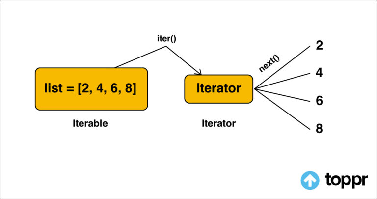

Lets visualize them using Matplotlib


```python
def matplotlib_imshow(img, one_channel=False):
    if one_channel:
        img = img.mean(dim=0)
    img = img / 2 + 0.5     # unnormalize
    npimg = img.numpy()
    if one_channel:
        plt.imshow(npimg, cmap="Greys")
    else:
        plt.imshow(np.transpose(npimg, (1, 2, 0)))

img_grid = torchvision.utils.make_grid(images)
matplotlib_imshow(img_grid, one_channel=True)
```


    
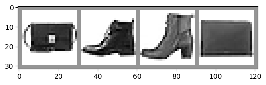
    


Now instead of using matplotlib , lets visualize it using `Tensorboard`.


```python
writer = SummaryWriter('runs/fashion_mnist_experiment_1')

# Writing  image data to TensorBoard log dir
writer.add_image('Four Fashion-MNIST Images', img_grid)
writer.flush()
```

To open the tensorboard host

```bash
$ tensorboard --logir=runs
```

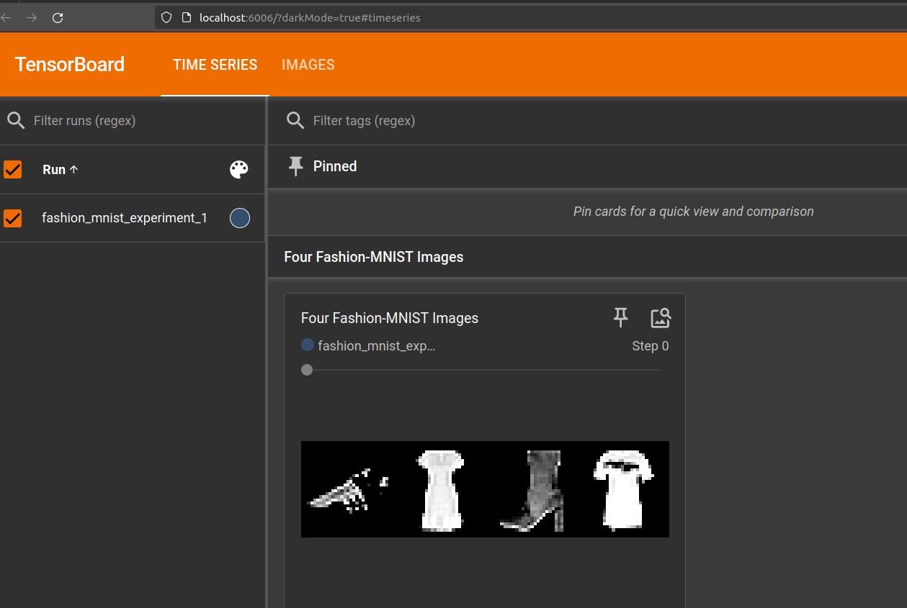

### Graphing Scalars to Visualize Training

Lets track the training metrics in `tensorboard`. One of the advantage of the tensorboard is that we can track the whole data of the training and visualize them easily with it.

Below is a deep convolution neural network which will  be used to classify the image data. When training this network we will log them into the tensorboard.


```python
class LeNet(nn.Module):
    def __init__(self):
        super(LeNet,self).__init__()
        self.conv1 = nn.Conv2d(1, 6, 5)
        self.pool = nn.MaxPool2d(2, 2)
        self.conv2 = nn.Conv2d(6, 16, 5)
        self.fc1 = nn.Linear(16 * 4 * 4, 120)
        self.fc2 = nn.Linear(120, 84)
        self.fc3 = nn.Linear(84, 10)

    def forward(self, x):
        x = self.pool(F.relu(self.conv1(x)))
        x = self.pool(F.relu(self.conv2(x)))
        x = x.view(-1, 16 * 4 * 4)
        x = F.relu(self.fc1(x))
        x = F.relu(self.fc2(x))
        x = self.fc3(x)
        return x


model = LeNet()
loss_func = nn.CrossEntropyLoss()
optimizer = optim.SGD(model.parameters(), lr=0.001, momentum=0.9)
```
### Inspecting the model using Tensorboard


```python
writer.add_graph(model, images)
writer.close
```
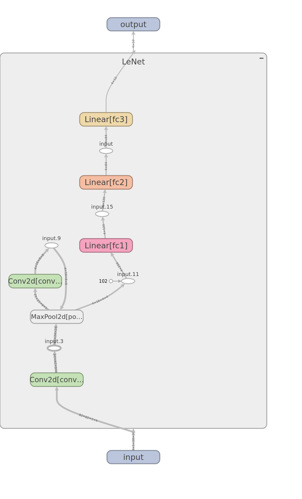

Now training

```python
for epoch in range(1):
    running_loss = 0
    print("Epoch {}".format(epoch))
    for i,data in enumerate(training_loader,0):
        inputs,labels = data # batch of 4
        optimizer.zero_grad() # resetting previous gradients to zero
        outputs = model(inputs) 
        loss = loss_func(outputs,labels)
        loss.backward() # Compute gradient
        optimizer.step() # update the parameters through calculated weights
        running_loss += loss.item() # loss.item() contains the loss of entire of mini-batch, but divided by the batch size

        # finding validation loss every 100 iteration for a epoch
        if i % 100 == 99 :
            print("Batch {}".format(i+1))
            running_vloss = 0
            # Since we are doing evaluation only we dont want to update the weights of the network. So,
            model.train(False)
            # lets find the running loss of the validation data
            for j, validation_data in enumerate(validation_loader,0):
                vinputs , vlabels = validation_data
                voutputs = model(vinputs)
                vloss = loss_func(voutputs, vlabels)
                running_vloss += vloss.item()
            
            # we have found both validation running loss and training loss. So lets write these data to tensorboard

            avg_training_loss = running_loss / 100
            avg_vloss = running_vloss / len(validation_loader)
            
            ##########################################################

            writer.add_scalars( 'Training and Validation Loss' , 
                {  'Training' : avg_training_loss , 'Validation ' : avg_vloss  },
                epoch * len(training_loader) + i )

            ###########################################################

            running_loss = 0.0

        if i == 1000 :
            break

    print("Training Finished")
    writer.flush()
```

    Epoch 0
    Batch 100
    Batch 200
    Batch 300
    Batch 400
    Batch 500
    Batch 600
    Batch 700
    Batch 800
    Batch 900
    Batch 1000
    Training Finished


To view the tensorboard logs, we go to the bash and do
```bash
tensorboard --logdir=runs
```

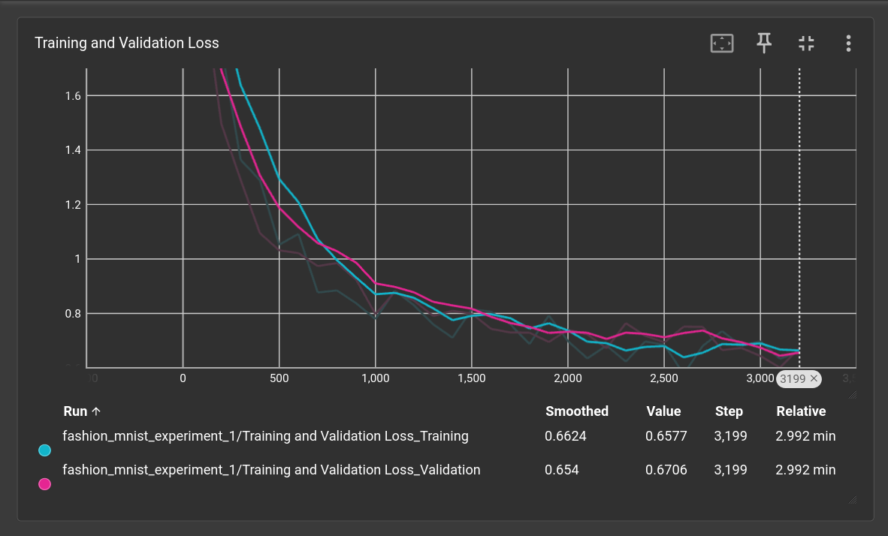


### Visualizing dataset with embeddings

When we pass the data into a simpler network , they will be flattened out. So if we want to visualize data into 3D axis with highest variance.

To do this, we use `add_embedding()` method which displays a interactive 3D chart.

`torch.randperm`

Returns a random permutation of integers from 0 to n - 1.


```python
# Select a random subset of data and corresponding labels
def select_n_random(data, labels, n=100):
    assert len(data) == len(labels)

    perm = torch.randperm(len(data))
    return data[perm][:n], labels[perm][:n]

# Extract a random subset of data
images, labels = select_n_random(training_set.data, training_set.targets)

# get the class labels for each image
class_labels = [classes[label] for label in labels]

# log embeddings
features = images.view(-1, 28 * 28)
writer.add_embedding(features,
                    metadata=class_labels,
                    label_img=images.unsqueeze(1))
writer.flush()
writer.close()
```

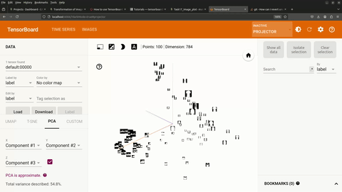


## Going through torch.utils.tensorboard


To log data for visualization by Tensorboard we use SummaryWriter class.

To instantiate SummaryWriter :

```python
from torch.utils.tensorboard import SummaryWriter
writer = SummaryWriter()
```

Lets read data from the dataset and log it into the tensorboard.


```python
 
from torch.utils.tensorboard import SummaryWriter
 
# lets create a writer object
writer = SummaryWriter()
transform = transforms.Compose([
    transforms.Resize((100,100)),
    transforms.ToTensor()
    ])

train_data = datasets.FashionMNIST( 
    root= '../data' ,
    train= True,
    download= True,
   transform = transform
)

trainloader = DataLoader(train_data, batch_size = 20 , shuffle = True)
```

Now lets get the first batch of our data. 


```python
first_batch = next(iter(trainloader))
```

first_batch has two parts, one is the image data and another is the label 


```python
images = first_batch[0]
labels = first_batch[1]
```

the data loader returns tuple of image and list , so we can directly assign them such as :


```python
first_batch_images , first_batch_labels = next(iter(trainloader))
```


```python
import matplotlib.pyplot as plt
plt.imshow( first_batch_images[0].permute(1,2,0))
plt.title(first_batch_labels[0])
```


    Text(0.5, 1.0, 'tensor(6)')


    
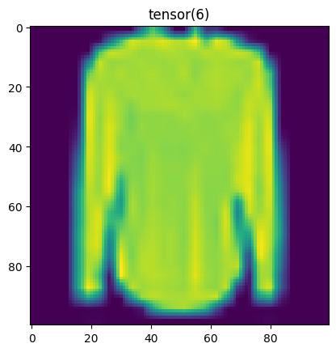
    


```python
first_batch_images.shape
```


    torch.Size([20, 1, 100, 100])


### Adding image grid into the tensorboard graph.

```python
grid = torchvision.utils.make_grid(first_batch_images)
grid.shape
```


    torch.Size([3, 308, 818])


```python
writer.add_image('images', grid, 0)  
writer.close()
```

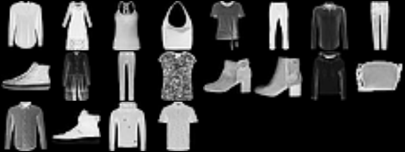

Lets look at some parameters of the `SummaryWriter` :

* `log_dir(str)` : Save directory location
* `comment(str)` : Suffix that will added to `log_dir`
* `max_queue (int)` : Size of the queue for pending events and summaries before one of the ‘add’ calls forces a flush to disk. Default is ten items.
* `flush_secs (int)` : Often time to log data. Default is every two minutes.


```python
writer = SummaryWriter()
```

> folder_location of log data : runs/Jun12_10-29-11_nitroV


```python
writer = SummaryWriter("log_data")
```

> folder_location of log data : log_data


```python
writer = SummaryWriter(comment= "Try1")
```

> folder_location of log data : runs/Jun12_10-33-48_nitroVTry1

## Grouping plots together

There will be a lot of data that will be generated in an experiment. So , to present information in a proper way and avoid cluttering we can group plots and name them hierrarchically.

### Adding Scalar Data

```python
writer.add_scalar('Tag' , scalar_value = scalar_data , global_step = current_count_step )
```


```python
from torch.utils.tensorboard import SummaryWriter
import numpy as np

writer = SummaryWriter()

for n_iter in range(100):
    writer.add_scalar('Group1/data1', np.random.random(), n_iter)
    writer.add_scalar('Group1/data2', np.random.random(), n_iter)
    writer.add_scalar('Group2/data1', np.random.random(), n_iter)
    writer.add_scalar('Group2/data2', np.random.random(), n_iter)
```

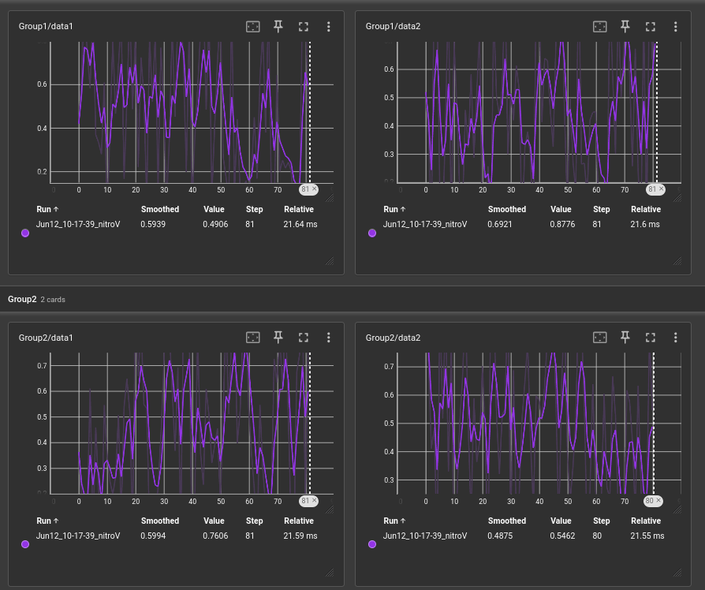

### Adding Scalars Data

```python
writer.add_scalars(main_tag, tag_scalar_dict, global_step=None, walltime=None)
```

`main_tag(str) `: The parent name for the tags  
`tag_scalar_dict(dict)` : Multiple Data, in the format Key-value pair ( dictionary)  
`global_step(int)` : Global step value to record  


```python
from torch.utils.tensorboard import SummaryWriter
writer = SummaryWriter()
r = 5
for i in range(100):
    writer.add_scalars('scalars_data', {'xsinx':i*np.sin(i/r),
                                    'xcosx':i*np.cos(i/r),
                                    'tanx': np.tan(i/r)}, i)
writer.close()
```

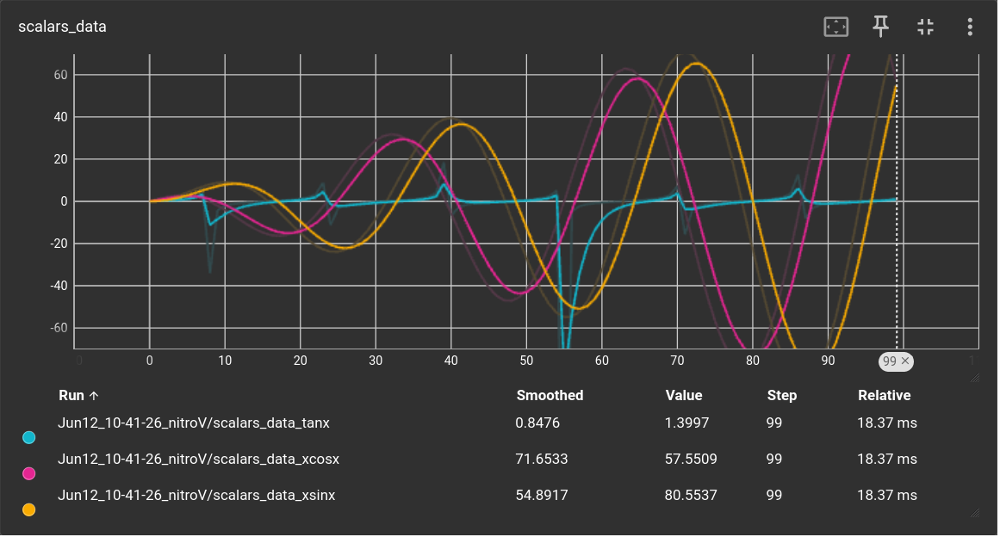

### Adding Histograms

```python
writer.add_histogram('Tag', data, global_step , bins)
```

`tag (str)` – Data identifier

`values `(torch.Tensor, numpy.ndarray, or string/blobname) – Values to build histogram

`global_step (int) `– Global step value to record

`bins (str)` – One of {‘tensorflow’,’auto’, ‘fd’, …}. This determines how the bins are made


```python
from torch.utils.tensorboard import SummaryWriter
import numpy as np
writer = SummaryWriter()
for i in range(10):
    x = np.random.random(1000)
    writer.add_histogram('distribution centers', x + i, i)
writer.close()
```

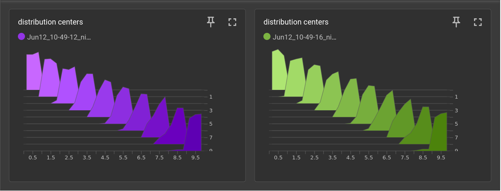

### Adding Image :

```python
writer.add_image( 'tag', img_tensor , global_step , dataformats)
```
dataformats : Image data format specification of the form CHW, HWC, HW, WH, etc. 

Where `H` refers to `height`, `W` refers to `width` and `C` refers to `channel`.


### Adding Images :

Add batched image data to summary. Requires `pillow` package.

```python
writer.add_image( 'tag', img_tensor , global_step , dataformats)
```
dataformats (str) – Image data format specification of the form NCHW, NHWC, CHW, HWC, HW, WH, etc.

Where `H` refers to `height`, `W` refers to `width`, `N`refers to number of images in batch and `C` refers to `channel`

Similarly there are various logging methods such as :

### Adding figure

Render matplotlib figure into an image and add it to summary.

```python
add_figure(tag, figure, global_step=None, close=True, walltime=None)
```
figure (Union[Figure, List[Figure]]) – Figure or a list of figures

close (bool) – Flag to automatically close the figure


```python
fig = plt.figure()
plt.plot(np.arange(0,10,0.1) , np.sin(np.arange(0,10,0.1)))
writer.add_figure('plot',fig)
```
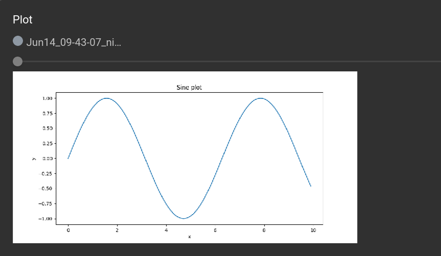

### Adding text
```python
writer.add_text('lstm', 'This is an lstm', 0)
writer.add_text('rnn', 'This is an rnn', 10)
```

### Adding Graph

Add graph data to summary.
```python
add_graph(model, input_to_model=None, verbose=False, use_strict_trace=True)
```

**Parameters**

* model (torch.nn.Module) – Model to draw.

* input_to_model (torch.Tensor or list of torch.Tensor) – A variable or a tuple of variables to be fed.

* verbose (bool) – Whether to print graph structure in console.

* use_strict_trace (bool) – Whether to pass keyword argument strict to torch.jit.trace. Pass False when you want the tracer to record your mutable container types (list, dict)


Lets define a simple neural network model and visualize its graph in tensorboard.
```python

class SimpleModel(nn.Module):
    def __init__(self):
        super(SimpleModel, self).__init__()
        self.fc1 = nn.Linear(10, 50)
        self.relu = nn.ReLU()
        self.fc2 = nn.Linear(50, 1)

    def forward(self, x):
        x = self.fc1(x)
        x = self.relu(x)
        x = self.fc2(x)
        return x
```

Now lets Initialize the model
```python
model = SimpleModel()
```

Create a dummy input tensor with the same shape as the input data

```python
dummy_input = torch.randn(1, 10)
```

Now to log the trained data we initialize SummaryWriter for TensorBoard
```python
writer = SummaryWriter()
```

To add the model graph to TensorBoard

```python
writer.add_graph(model, input_to_model=dummy_input, verbose=False, use_strict_trace=True)
```

and finally we close the writer
```python
writer.close()
```

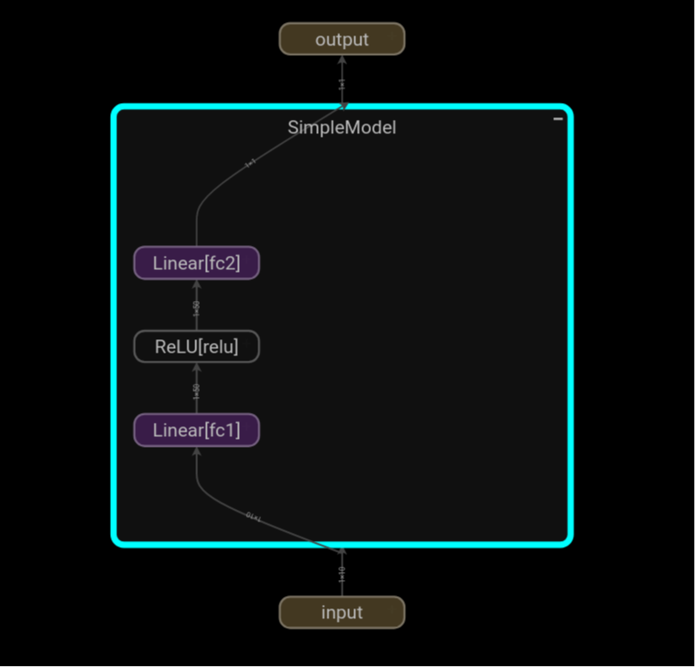
